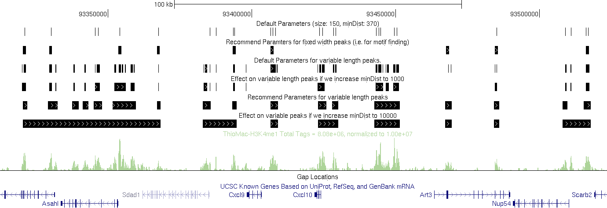
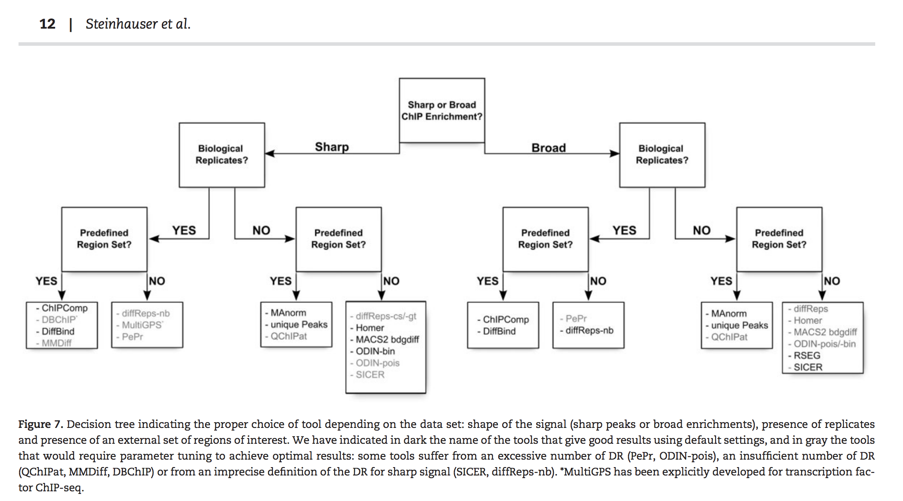
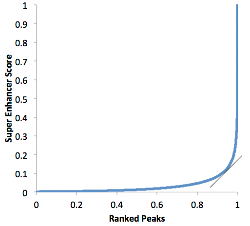
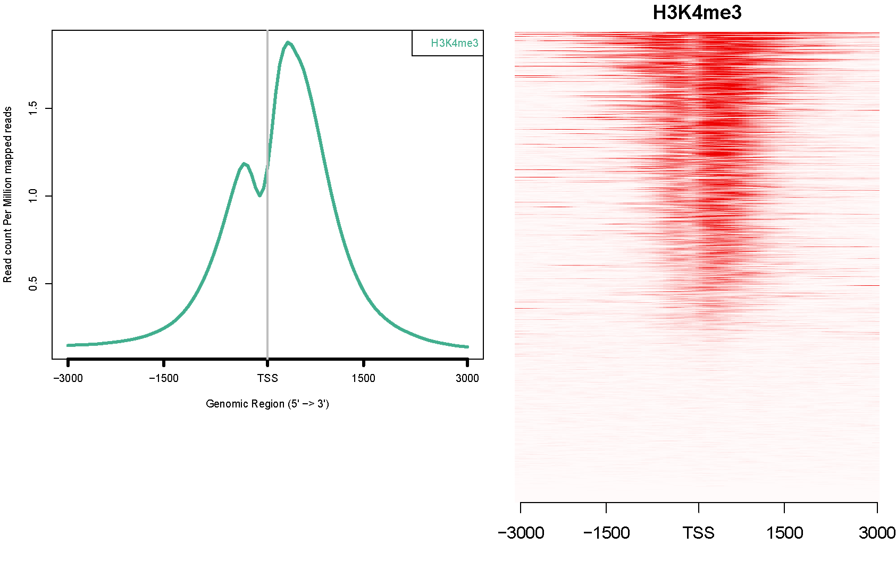

# ChIP-seq-analysis

### A pipeline

I developed a Snakemake based ChIP-seq pipeline: [pyflow-ChIPseq](https://github.com/crazyhottommy/pyflow-ChIPseq).

### Resources for ChIP-seq 
1. [ENCODE: Encyclopedia of DNA Elements](https://www.encodeproject.org/)  [ENCODExplorer](https://www.bioconductor.org/packages/release/bioc/html/ENCODExplorer.html): A compilation of metadata from ENCODE. A bioc package to access the meta data of ENCODE and download the raw files.
2. [ENCODE Factorbook](https://www.encodeproject.org/)  
3. [ChromNet ChIP-seq interactions](http://chromnet.cs.washington.edu/#/?search=&threshold=0.5)  
    paper: [Learning the human chromatin network using all ENCODE ChIP-seq datasets](http://biorxiv.org/content/early/2015/08/04/023911)  
4. [The International Human Epigenome Consortium (IHEC) epigenome data portal](http://epigenomesportal.ca/ihec/index.html?as=1)
5. [GEO](http://www.ncbi.nlm.nih.gov/gds/?term=). Sequences are in .sra format, need to use sratools to dump into fastq.
6. [European Nucleotide Archive](http://www.ebi.ac.uk/ena). Sequences are available in fastq format.
7. [Data bases and software from Sheirly Liu's lab at Harvard](http://liulab.dfci.harvard.edu/WEBSITE/software.htm)
8. [Blueprint epigenome](http://dcc.blueprint-epigenome.eu/#/home)
9. [A collection of tools and papers for nucelosome positioning and TF ChIP-seq](http://generegulation.info/)
10. [review paper:Deciphering ENCODE](http://www.cell.com/trends/genetics/fulltext/S0168-9525(16)00017-2)
11. [EpiFactors](http://epifactors.autosome.ru/) is a database for epigenetic factors, corresponding genes and products.
12. [biostar handbook](https://read.biostarhandbook.com/). My [ChIP-seq chapter](https://read.biostarhandbook.com/chip-seq/chip-seq-analysis.html) is out April 2017!
13. [ReMap 2018](http://tagc.univ-mrs.fr/remap/) An integrative ChIP-seq analysis of regulatory regions. The ReMap atlas consits of 80 million peaks from 485 transcription factors (TFs), transcription coactivators (TCAs) and chromatin-remodeling factors (CRFs) from public data sets. The atlas is available to browse or download either for a given TF or cell line, or for the entire dataset. 

### Papers on ChIP-seq
1. [ChIP-seq guidelines and practices of the ENCODE and modENCODE consortia](http://www.ncbi.nlm.nih.gov/pubmed/22955991) 
2. [Practical Guidelines for the Comprehensive Analysis of ChIP-seq Data](http://journals.plos.org/ploscompbiol/article?id=10.1371/journal.pcbi.1003326)    
3. [Systematic evaluation of factors influencing ChIP-seq fidelity](http://www.nature.com/nmeth/journal/v9/n6/full/nmeth.1985.html)
4. [ChIP–seq: advantages and challenges of a maturing technology](http://www.nature.com/nrg/journal/v10/n10/abs/nrg2641.html)
5. [ChIP–seq and beyond: new and improved methodologies to detect and characterize protein–DNA interactions](http://www.nature.com/nrg/journal/v13/n12/abs/nrg3306.html) 
6. [Beyond library size: a field guide to NGS normalization](http://biorxiv.org/content/early/2014/06/19/006403)
7. [ENCODE paper portol](http://www.nature.com/encode/threads)  
8. [Enhancer discovery and characterization](http://www.nature.com/encode/threads/enhancer-discovery-and-characterization) 
9. 2016 review [Recent advances in ChIP-seq analysis: from quality management to whole-genome annotation](http://bib.oxfordjournals.org/content/early/2016/03/15/bib.bbw023.full)
10. [bioinformatics paper:Features that define the best ChIP-seq peak calling algorithms](http://bib.oxfordjournals.org/content/early/2016/05/10/bib.bbw035.short?rss=1) compares different peak callers for TFs and histones.
11. [Systematic comparison of monoclonal versus polyclonal antibodies for mapping histone modifications by ChIP-seq](http://biorxiv.org/content/early/2016/05/19/054387) The binding patterns for H3K27ac differed substantially between polyclonal and monoclonal antibodies. However, this was most likely due to the distinct immunogen used rather than the clonality of the antibody. Altogether, we found that monoclonal antibodies as a class perform as well as polyclonal antibodies. Accordingly, we recommend the use of monoclonal antibodies in ChIP-seq experiments.
12. A nice small review: [Unraveling the 3D genome: genomics tools for multiscale exploration](http://www.cell.com/trends/genetics/pdf/S0168-9525(15)00063-3.pdf)
13. Three very interesting papers, [Developmental biology: Panoramic views of the early epigenome](http://www.nature.com/nature/journal/v537/n7621/full/nature19468.html)
14. [ChIP off the old block: Beyond chromatin immunoprecipitation](https://www.sciencemag.org/features/2018/12/chip-old-block-beyond-chromatin-immunoprecipitation). A nice review of the past and future of ChIPseq.
15. [Histone Modifications: Insights into Their Influence on Gene Expression](https://www.sciencedirect.com/science/article/pii/S0092867418310481)

    **Protocols**  
1. [A computational pipeline for comparative ChIP-seq analyses](http://www.ncbi.nlm.nih.gov/pubmed/22179591)    
2. [Identifying ChIP-seq enrichment using MACS](http://www.nature.com/nprot/journal/v7/n9/full/nprot.2012.101.html)  
3. [Spatial clustering for identification of ChIP-enriched regions (SICER) to map regions of histone methylation patterns in embryonic stem cells](http://www.ncbi.nlm.nih.gov/pubmed/24743992)
4. [ENCODE tutorials](http://www.genome.gov/27553900) 
5. [A User's Guide to the Encyclopedia of DNA Elements (ENCODE)](http://journals.plos.org/plosbiology/article?id=10.1371/journal.pbio.1001046)  
6. [A toolbox of immunoprecipitation-grade monoclonal antibodies to human transcription factors](https://www.nature.com/articles/nmeth.4632) The data portal https://proteincapture.org/

### Quality Control
Data downloaded from GEO usually are raw fastq files. One needs to do quality control (QC) on them.

* [fastqc](http://www.bioinformatics.babraham.ac.uk/projects/fastqc/)  
* [multiqc](http://multiqc.info/) Aggregate results from bioinformatics analyses across many samples into a single report. Could be very useful to summarize the QC report. 

### Peak calling  

Be careful with the peaks you get:  
[Active promoters give rise to false positive ‘Phantom Peaks’ in ChIP-seq experiments](http://nar.oxfordjournals.org/content/early/2015/06/27/nar.gkv637.long)    

It is good to have controls for your ChIP-seq experiments. A DNA input control (no antibody is applied) is prefered.
The IgG control is also fine, but because so little DNA is there, you might get many duplicated reads due to PCR artifact.

**For cancer cells, an input control can be used to correct for copy-number bias.**

* [tools used by IHEC consortium](http://ihec-epigenomes.org/research/tools/)

[A quote from Tao Liu:](https://groups.google.com/forum/#!searchin/macs-announcement/h3k27ac/macs-announcement/9_LB5EsjS_Y/nwgsPN8lR-kJ) who develped MACS1/2

>I remember in a PloS One paper last year by Elizabeth G. Wilbanks et al.,  authors pointed out the best way to sort results in MACS is by -10*log10(pvalue) then fold enrichment. I agree with them. You don't have to worry about FDR too much if your input data are far more than ChIP data. MACS1.4 calculates FDR by swapping samples, so if your input signal has some strong bias somewhere in the genome, your FDR result would be bad. Bad FDR may mean something but it's just secondary.

1. The most popular peak caller by Tao Liu: [MACS2](https://github.com/taoliu/MACS/). Now `--broad` flag supports broad peaks calling as well.

2. [TF ChIP-seq peak calling using the Irreproducibility Discovery Rate (IDR) framework](https://sites.google.com/site/anshulkundaje/projects/idr) and many [Software Tools Used to Create the ENCODE Resource](https://genome.ucsc.edu/ENCODE/encodeTools.html)    
3. [SICER](http://home.gwu.edu/~wpeng/Software.htm) for broad histone modification ChIP-seq
4. [HOMER](http://homer.salk.edu/homer/ngs/peaks.html) can also used to call Transcription factor ChIP-seq peaks and histone 
    modification ChIP-seq peaks.
5. [MUSIC](https://github.com/gersteinlab/MUSIC)
6. [permseq](https://github.com/keleslab/permseq)  R package for mapping protein-DNA interactions in highly repetitive regions of the genomes with prior-enhanced read mapping. [Paper](http://www.ncbi.nlm.nih.gov/pmc/articles/PMC4618727/pdf/pcbi.1004491.pdf) on PLos Comp.
7. [Ritornello](http://www.biorxiv.org/content/early/2015/12/11/034090): High fidelity control-free chip-seq peak calling. No input is required!
8. Tumor samples are heterogeneous containing different cell types. [MixChIP: a probabilistic method for cell type specific protein-DNA binding analysis](http://bmcbioinformatics.biomedcentral.com/articles/10.1186/s12859-015-0834-3) 
9. [Detecting broad domains and narrow peaks in ChIP-seq data with hiddenDomains](http://bmcbioinformatics.biomedcentral.com/articles/10.1186/s12859-016-0991-z) [tool](http://hiddendomains.sourceforge.net/)
10. [BroadPeak: a novel algorithm for identifying broad peaks in diffuse ChIP-seq datasets](http://bioinformatics.oxfordjournals.org/content/29/4/492)
11. [epic: diffuse domain ChIP-Seq caller based on SICER]( https://github.com/endrebak/epic). It is a re-writen of SICER for faster processing using more CPUs. (Will try it for broad peak for sure).
    [epic2](https://github.com/biocore-ntnu/epic2) paper is out https://academic.oup.com/bioinformatics/advance-article-abstract/doi/10.1093/bioinformatics/btz232/5421513?redirectedFrom=fulltext
12. [Cistrome](http://cistrome.org/Cistrome/Cistrome_Project.html): The best place for wet lab scientist to check the binding sites. Developed by Shierly Liu lab in Harvard.
13. [ChIP-Atlas](http://chip-atlas.org/) is an integrative and comprehensive database for visualizing and making use of public ChIP-seq data. ChIP-Atlas covers almost all public ChIP-seq data submitted to the SRA (Sequence Read Archives) in NCBI, DDBJ, or ENA, and is based on over 78,000 experiments.
14. [A map of direct TF-DNA interactions in the human genome](https://unibind.uio.no/) UniBind is a comprehensive map of direct interactions between transcription factor (TFs) and DNA. High confidence TF binding site predictions were obtained from uniform processing of thousands of ChIP-seq data sets using the ChIP-eat software.
15. [Accounting for GC-content bias reduces systematic errors and batch effects in ChIP-Seq peak callers](http://biorxiv.org/content/early/2016/12/01/090704) tool in [github](https://github.com/tengmx/gcapc)
16. [SUPERmerge](https://github.com/Bohdan-Khomtchouk/SUPERmerge):ChIP-seq coverage island analysis algorithm for broad histone marks
17. [PeakRanger](http://ranger.sourceforge.net/manual1.18.html) heard that it is good for broad peaks of H3K9me3 and H3K27me3.

**Different parameters using the same program can produce drastic different sets of peaks especially for histone modifications with variable enrichment length and gaps between peaks. One needs to make a valid argument for parameters he uses**  

An example of different parameters for homer `findPeaks`:  

### Tutorial

* [tutorial by Simon van Heeringen at bioinfosummer](https://github.com/simonvh/bioinfosummer)

### Binding does not infer functionality  

* [A significant proportion of transcription-factor binding sites may be nonfunctional](http://judgestarling.tumblr.com/post/64874995999/hypotheses-about-the-functionality-of) A post from Judge Starling  

* Several papers have shown that changes of adjacent TF binding poorly correlates with gene expression change:
[Extensive Divergence of Transcription Factor Binding in Drosophila Embryos with Highly Conserved Gene Expression](http://www.plosgenetics.org/article/info%3Adoi%2F10.1371%2Fjournal.pgen.1003748)  
[Transcription Factors Bind Thousands of Active and Inactive Regions in theDrosophila Blastoderm](http://www.plosbiology.org/article/info%3Adoi%2F10.1371%2Fjournal.pbio.0060027)    

[The Functional Consequences of Variation in Transcription Factor Binding](http://arxiv.org/abs/1310.5166)  
>" On average, 14.7% of genes bound by a factor were differentially expressed following the knockdown of that factor, suggesting that most interactions between TF and chromatin do not result in measurable changes in gene expression levels of putative target genes. "

* paper [A large portion of the ChIP-seq signal does not correspond to true binding](http://www.ncbi.nlm.nih.gov/pubmed/26388941?dopt=Abstract&utm_source=dlvr.it&utm_medium=twitter)
* [BIDCHIPS: Bias-Decomposition of ChIP-seq Signals](http://www.perkinslab.ca/Software.html)  
	**mappability, GC-content and chromatin accessibility** affect ChIP-seq read counts. 
* [ChIP bias as a function of cross-linking time](http://link.springer.com/article/10.1007%2Fs10577-015-9509-1)   

>We analyzed the dependence of the ChIP signal on the duration of formaldehyde cross-linking time for two proteins: DNA topoisomerase 1 (Top1) that is functionally associated with the double helix in vivo, especially with active chromatin, and green fluorescent protein (GFP) that has no known bona fide interactions with DNA. With short time of formaldehyde fixation, only Top1 immunoprecipation efficiently recovered DNA from active promoters, whereas prolonged fixation augmented non-specific recovery of GFP dramatizing the need to optimize ChIP protocols to minimize the time of cross-linking, especially for abundant nuclear proteins. Thus, ChIP is a powerful approach to study the localization of protein on the genome when care is taken to manage potential artifacts.

### Gene set enrichment analysis for ChIP-seq peaks  

[The Gene Ontology Handbook](http://link.springer.com/protocol/10.1007%2F978-1-4939-3743-1_13) Read it for basics for GO.

1. [Broad Enrich](http://broad-enrich.med.umich.edu/)  
2. [ChIP Enrich](http://chip-enrich.med.umich.edu/)  
3. [GREAT](http://bejerano.stanford.edu/great/public/html/) predicts functions of cis-regulatory regions.  
4. [ENCODE ChIP-seq significance tool](http://encodeqt.simple-encode.org/). Given a list of genes, co-regulating TFs will be identified.  
5. [cscan](http://159.149.160.51/cscan/) similar to the ENCODE significance tool.  
6. [CompGO: an R package for comparing and visualizing Gene Ontology enrichment differences between DNA binding experiments](http://www.biomedcentral.com/1471-2105/16/275)  
7. [interactive and collaborative HTML5 gene list enrichment analysis tool](http://amp.pharm.mssm.edu/Enrichr/)
8. [GeNets](http://www.broadinstitute.org/genets#computations) from Broad. Looks very promising.
9. [Bioconductor EnrichmentBrowser](https://www.bioconductor.org/packages/3.3/bioc/html/EnrichmentBrowser.html)
10. [clusterProfiler](http://bioconductor.org/packages/release/bioc/vignettes/clusterProfiler/inst/doc/clusterProfiler.html) by Guangchuan Yu, the author of `ChIPseeker`.
11. [fgsea bioconductor package](http://bioconductor.org/packages/devel/bioc/html/fgsea.html) Fast Gene Set Entrichment Analysis.
12. [paper: A Comparison of Gene Set Analysis Methods in Terms of Sensitivity, Prioritization and Specificity](http://journals.plos.org/plosone/article?id=10.1371/journal.pone.0079217#pone-0079217-t001)
13. [UniBind Enrichment Analysis](https://unibind.uio.no/enrichment/) predicts which sets of TFBSs from the UniBind database are enriched in a set of given genomic regions. Enrichment computations are performed using the LOLA tool.
14. [BEHST](https://www.biorxiv.org/content/10.1101/168427v1) from Hoffman group: genomic set enrichment analysis enhanced through integration of chromatin long-range interactions

### Chromatin state Segmentation  
1. [ChromHMM](http://compbio.mit.edu/ChromHMM/)  from Manolis Kellis in MIT.
  >In ChromHMM the raw reads are assigned to non-overlapping bins of 200 bps and a sample-specific threshold is used to transform the count data to binary values

2. [Segway](https://www.pmgenomics.ca/hoffmanlab/proj/segway/) from Hoffman lab. Base pair resolution. Takes longer time to run.  
3. [epicseg](https://github.com/lamortenera/epicseg) published 2015 in genome biology. Similiar speed with ChromHMM.   
4. [Spectacle: fast chromatin state annotation using spectral learning](https://github.com/jiminsong/Spectacle). Also published 2015 in genome biology.  
5. [chromstaR](http://biorxiv.org/content/early/2016/02/04/038612): Tracking combinatorial chromatin state dynamics in space and time
6. [epilogos](http://epilogos.broadinstitute.org/) visualization and analysis of chromatin state model data.
7. [Accurate promoter and enhancer identification in 127 ENCODE and Roadmap Epigenomics cell types and tissues by GenoSTAN](http://biorxiv.org/content/early/2016/02/24/041020)
8. [StatePaintR](https://github.com/Simon-Coetzee/StatePaintR) StateHub-StatePaintR: rules-based chromatin state annotations.
9. [IDEAS(https://github.com/yuzhang123/IDEAS/): an integrative and discriminative epigenome annotation system  http://sites.stat.psu.edu/~yzz2/IDEAS/

### deep learning in ChIP-seq
* [Coda](https://github.com/kundajelab/coda) uses convolutional neural networks to learn a mapping from noisy to high-quality ChIP-seq data. These trained networks can then be used to remove noise and improve the quality of new ChIP-seq data. From Ashul lab.
* [DeepChrome](https://github.com/QData/DeepChrome) is a unified CNN framework that automatically learns combinatorial interactions among histone modification marks to predict the gene expression. (Is it really better than a simple linear model?)
* [deep learning in biology](https://github.com/hussius/deeplearning-biology)

### Peak annotation 

1. Homer [`annotatePeak`](http://homer.salk.edu/homer/ngs/annotation.html) 
2. Bioconductor package [ChIPseeker](http://bioconductor.org/packages/release/bioc/html/ChIPseeker.html) by [Guangchuan Yu](http://ygc.name/)   
   See an important post by him on 0 or 1 based [coordinates](http://ygc.name/2015/08/07/parsing-bed-coordinates/).
 
 >Most of the software for ChIP annotation doesn't considered this issue when annotating peak (0-based) to transcript (1-based). To my knowledge, only HOMER consider this issue. After I figure this out, I have updated ChIPseeker (version >= 1.4.3) to fix the issue.
 
3. Bioconductor package [ChIPpeakAnno](http://bioconductor.org/packages/release/bioc/html/ChIPpeakAnno.html). There is a bug with this package, not sure if it is solved or not. Still a post from Guangchuan Yu: [Bug of R package ChIPpeakAnno](http://ygc.name/2014/01/14/bug-of-r-package-chippeakanno/). 

 >I used R package ChIPpeakAnno for annotating peaks, and found that it handle  the DNA strand in the wrong way. Maybe the developers were from the computer science but not biology background.

4. [annotatr](https://github.com/rcavalcante/annotatr/) Annotation of Genomic Regions to Genomic Annotations.

5. [geneXtendeR](https://bioconductor.org/packages/release/bioc/html/geneXtendeR.html) computes optimal gene extensions tailored to the broadness of the specific epigenetic mark (e.g., H3K9me1, H3K27me3), as determined by a user-supplied ChIP-seq peak input file. As such, geneXtender maximizes the signal-to-noise ratio of locating genes closest to and directly under peaks

* [DNAshapeR predicts DNA shape features in an ultra-fast, high-throughput manner from genomic sequencing data](http://tsupeichiu.github.io/DNAshapeR/)  

### Differential peak detection  
Look at a [post](http://andre-rendeiro.me/2015/04/03/chipseq_diffbind_analysis/) and [here](http://crazyhottommy.blogspot.com/2013/10/compare-chip-seq-data-for-different.html) describing different tools. 
A review paper [A comprehensive comparison of tools for differential ChIP-seq analysis](http://bib.oxfordjournals.org/content/early/2016/01/12/bib.bbv110.short?rss=1)  

1. [MultiGPS](http://mahonylab.org/software/multigps/)  

2. [PePr](https://github.com/shawnzhangyx/PePr). It can also call peaks.  

3. [histoneHMM](http://histonehmm.molgen.mpg.de/)  

4. [diffreps](https://github.com/shenlab-sinai/diffreps) for histone.  developed by Shen Li's lab in Mount Sinai who also develped [ngs.plot](https://github.com/shenlab-sinai/ngsplot).  

5. [diffbind bioconductor package](http://bioconductor.org/packages/release/bioc/html/DiffBind.html). Internally uses RNA-seq tools: EdgR or DESeq.  Most likely, I will use this tool.  

6. [ChIPComp](http://web1.sph.emory.edu/users/hwu30/software/ChIPComp.html). Very little tutorial. Now it is on bioconductor.

7. [csaw bioconductor package](http://bioconductor.org/packages/release/bioc/html/csaw.html). Tutorial [here](https://www.bioconductor.org/help/course-materials/2015/BioC2015/csaw_lab.html)  

8. [chromDiff](http://compbio.mit.edu/ChromDiff/Download.html). Also from from Manolis Kellis in MIT. Similar with ChromHMM, documentation is not that detailed. Will have a try on this.  
9. [MACS2 can detect differential peaks as well](https://github.com/taoliu/MACS/wiki/Call-differential-binding-events)  
10. paper [Identifying differential transcription factor binding in ChIP-seq](http://journal.frontiersin.org/article/10.3389/fgene.2015.00169/full)  

### Motif enrichment
1. [HOMER](http://homer.salk.edu/homer/ngs/peakMotifs.html). It has really detailed documentation. It can also be used to call peaks. 

For TF ChIP-seq, one can usually find the summit of the peak (macs14 will report the summit), and extend the summit to both sides to 100bp-500bp. One can then use those 100bp-500 bp small regions to do motif analysis. Usually, oen should find the motif for the ChIPed TF in the ChIP-seq experiment if it is a DNA binding protein.

It is trickier to do motif analysis using histone modification ChIP-seq. For example, the average peak size of H3K27ac is 2~3 kb. If one wants to find TF binding motifs from H3K27ac ChIP-seq data, it is good to narrow down the region a bit. MEME and many other motif finding tools require that the DNA sequence length to be small (~500bp). One way is to use `findPeaks` in homer turning on `-nfr`(nucleosome free region) flag, and then do motif analysis in those regions.

suggestions for finding motifs from histone modification ChIP-seq data from HOMER page:
>Since you are looking at a region, you do not necessarily want to center the peak on the specific position with the highest tag density, which may be at the edge of the region.  Besides, in the case of histone modifications at enhancers, the highest signal will usually be found on nucleosomes surrounding the center of the enhancer, which is where the functional sequences and transcription factor binding sites reside.  Consider H3K4me marks surrounding distal PU.1 transcription factor peaks.  Typically, adding the -center >option moves peaks further away from the functional sequence in these scenarios.

Other strategy similar to `-nfr` was developed in this paper: [Dissecting neural differentiation regulatory networks through epigenetic footprinting](http://www.ncbi.nlm.nih.gov/pubmed/25533951). In the method part of the paper, the authors computed a depletion score within the peaks, and use the footprinted regions to do motif analysis. (Thanks [kadir](https://twitter.com/canerakdemir) for pointing out the paper)

http://homer.ucsd.edu/homer/ngs/peakMotifs.html  

>Region Size ("-size <#>", "-size <#>,<#>", "-size given", default: 200)
The size of the region used for motif finding is important.  If analyzing ChIP-Seq peaks from a transcription factor, Chuck would recommend 50 bp for establishing the primary motif bound by a given transcription factor and 200 bp for finding both primary and "co-enriched" motifs for a transcription factor.  When looking at histone marked regions, **500-1000 bp is probably a good idea (i.e. H3K4me or H3/H4 acetylated regions)**.  In theory, HOMER can work with very large regions (i.e. 10kb), but with the larger the regions comes more sequence and longer execution time.  These regions will be based off the center of the peaks.  If you prefer an offset, you can specify "-size -300,100" to search a region of size 400 that is centered 100 bp upstream of the peak center (useful if doing motif finding on putative TSS regions).  If you have variable length regions, use the option "-size given" and HOMER will use the exact regions that were used as input.

I just found [PARE](http://spundhir.github.io/PARE/). PARE is a computational method to Predict Active Regulatory Elements, specifically enhancers and promoters. H3K27ac and H3K4me can be used to define active enhancers.

2. [MEME suite](http://meme.ebi.edu.au/meme/index.html). It is probably the most popular motif finding tool in the papers.  [protocol:Motif-based analysis of large nucleotide data sets using MEME-ChIP](http://www.nature.com/nprot/journal/v9/n6/full/nprot.2014.083.html)  
3. [JASPAR database](http://jaspar.binf.ku.dk/  )
3. [pScan-ChIP](http://159.149.160.51/pscan_chip_dev/)  
4. [MotifMap](http://motifmap.ics.uci.edu/#MotifSearch)  
5. [RAST](http://rsat01.biologie.ens.fr/rsa-tools/index.html) Regulatory Sequence Analysis Tools.  
6. [ENCODE TF motif database](http://compbio.mit.edu/encode-motifs/)  
7. [oPOSSUM](http://opossum.cisreg.ca/oPOSSUM3/) is a web-based system for the detection of over-represented conserved transcription factor binding sites and binding site combinations in sets of genes or sequences.  
8.  my post [how to get a genome-wide motif bed file](http://crazyhottommy.blogspot.com/2014/02/how-to-get-genome-wide-motif-bed-file.html) 
9.  Many other tools [here](http://omictools.com/motif-discovery-c84-p1.html)
10. [A review of ensemble methods for de novo motif discovery in ChIP-Seq data](http://bib.oxfordjournals.org/content/early/2015/04/17/bib.bbv022.abstract)  
11. [melina2](http://melina2.hgc.jp/public/index.html). If you only have one sequence and want to know what TFs might bind
    there, this is a very useful tool.
12. [STEME](https://pypi.python.org/pypi/STEME/). A python library for motif analysis. STEME started life as an approximation to the Expectation-Maximisation algorithm for the type of model used in motif finders such as MEME. **STEME’s EM approximation runs an order of magnitude more quickly than the MEME implementation for typical parameter settings**. STEME has now developed into a fully-fledged motif finder in its own right.  
13. [CENTIPEDE: Transcription factor footprinting and binding site prediction](http://centipede.uchicago.edu/). [Tutorial](https://github.com/slowkow/CENTIPEDE.tutorial)  
14. [msCentipede: Modeling Heterogeneity across Genomic Sites and Replicates Improves Accuracy in the Inference of Transcription Factor Binding](http://rajanil.github.io/msCentipede/)  
15. [DiffLogo: A comparative visualisation of sequence motifs](http://bioconductor.org/packages/release/bioc/html/DiffLogo.html) 
16. [Weeder (version: 2.0)](http://159.149.160.51/modtools/)
17. [MCAST: scanning for cis-regulatory motif clusters](http://bioinformatics.oxfordjournals.org/content/early/2016/01/14/bioinformatics.btv750.short?rss=1) Part of MEME suite.
18. [Sequence-based Discovery of Regulons](http://iregulon.aertslab.org/) iRegulon detects the TF, the targets and the motifs/tracks from a set of genes.
19. [Regulatory genomic toolbox](http://www.regulatory-genomics.org/motif-analysis/introduction/)
20. [Parse TF motifs from public databases, read into R, and scan using 'rtfbs'](https://github.com/Danko-Lab/rtfbs_db)
21. [Romulus: Robust multi-state identification of transcription factor binding sites from DNase-seq data](https://github.com/ajank/Romulus): Romulus is a computational method to accurately identify individual transcription factor binding sites from genome sequence information and cell-type--specific experimental data, such as DNase-seq. It combines the strengths of its predecessors, CENTIPEDE and Wellington, while keeping the number of free parameters in the model robustly low. The method is unique in allowing for multiple binding states for a single transcription factor, differing in their cut profile and overall number of DNase I cuts.
22. [moca](https://github.com/saketkc/moca): Tool for motif conservation analysis.
23. [gimmemotifs](https://github.com/simonvh/gimmemotifs) Suite of motif tools, including a motif prediction pipeline for ChIP-seq experiments. looks very useful, will take a look!
24. [YAMDA](https://github.com/daquang/YAMDA): thousandfold speedup of EM-based motif discovery using deep learning libraries and GPU

### Super-enhancer identification   

The fancy "supper-enhancer" term was first introduced by [Richard Young](http://younglab.wi.mit.edu/publications.htm) in Whitehead Institute. Basically, super-enhancers are enhancers that span large genomic regions(~12.5kb). The concept of super-enhancer is not new. One of the most famous example is the Locus Control Region (LCR) that controls the globin gene expression, and this has been known for decades.  

A review in Nature Genetics [What are super-enhancers?](http://www.nature.com/ng/journal/v47/n1/full/ng.3167.html)  

[paper: Genetic dissection of the α-globin super-enhancer in vivo](http://www.nature.com/ng/journal/v48/n8/full/ng.3605.html) 

> By generating a series of mouse models, deleting each of the five regulatory elements of the α-globin super-enhancer individually and in informative combinations, we demonstrate that each constituent enhancer seems to act independently and in an additive fashion with respect to hematological phenotype, gene expression, chromatin structure and chromosome conformation, without clear evidence of synergistic or higher-order effects.

[paper: Hierarchy within the mammary STAT5-driven Wap super-enhancer](http://www.nature.com/ng/journal/v48/n8/full/ng.3606.html)  
[paper: Enhancers and super-enhancers have an equivalent regulatory role in embryonic stem cells through regulation of single or multiple genes](http://m.genome.cshlp.org/content/early/2016/11/28/gr.210930.116.abstract)

From the [HOMER page](http://homer.salk.edu/homer/ngs/peaks.html)
**How finding super enhancers works:**

>Super enhancer discovery in HOMER emulates the original strategy used by the Young lab.  First, peaks are found just like any other ChIP-Seq data set.  Then, peaks found within a given distance are 'stitched' together into larger regions (by default this is set at 12.5 kb).  The super enhancer signal of each of these regions is then determined by the total normalized number reads minus the number of normalized reads in the input.  These regions are then sorted by their score, normalized to the highest score and the number of putative enhancer regions, and then super enhancers are identified as regions past the point where the slope is greater than 1.  

Example of a super enhancer plot:

>In the plot above, all of the peaks past 0.95 or so would be considered "super enhancers", while the one's below would be "typical" enhancers.  If the slope threshold of 1 seems arbitrary to you, well... it is!  This part is probably the 'weakest link' in the super enhancer definition.  However, the concept is still very useful.  Please keep in mind that most enhancers probably fall on a continuum between typical and super enhancer status, so don't bother fighting over the precise number of super enhancers in a given sample and instead look for useful trends in the data.

**Using ROSE from Young lab**   
[ROSE: RANK ORDERING OF SUPER-ENHANCERS](http://younglab.wi.mit.edu/super_enhancer_code.html)  

**[imPROSE](https://github.com/asntech/improse) - Integrated Methods for Prediction of Super-Enhancers

### Bedgraph, bigwig manipulation tools
[WiggleTools](https://github.com/Ensembl/WiggleTools)  
[bigwig tool](https://github.com/CRG-Barcelona/bwtool/wiki)  
[bigwig-python](https://github.com/brentp/bw-python)  
[samtools](http://www.htslib.org/)    
[bedtools](http://bedtools.readthedocs.org/en/latest/) my all-time favorite tool from Araon Quinlan' lab. Great documentation!   
[Hosting bigWig for UCSC visualization](http://crazyhottommy.blogspot.com/2014/02/hosting-bigwig-by-dropbox-for-ucsc.html)  
[My first play with GRO-seq data, from sam to bedgraph for visualization](http://crazyhottommy.blogspot.com/2013/10/my-first-play-with-gro-seq-data-from.html)  
[convert bam file to bigwig file and visualize in UCSC genome browser in a Box (GBiB)](http://crazyhottommy.blogspot.com/2014/10/convert-bam-file-to-bigwig-file-and.html)  

### Peaks overlapping significance test
[The genomic association tester (GAT)](https://github.com/AndreasHeger/gat)  
[poverlap](https://github.com/brentp/poverlap) from Brent Pedersen. Now he is working with Aaron Quinlan at university of Utah.  
[Genometric Correlation (GenometriCorr): an R package for spatial correlation of genome-wide interval datasets](http://genometricorr.sourceforge.net/)  
[Location overlap analysis for enrichment of genomic ranges](http://bioconductor.org/packages/release/bioc/html/LOLA.html) bioconductor package.   
[regioneR](http://bioconductor.org/packages/release/bioc/html/regioneR.html) Association analysis of genomic regions based on permutation tests
[similaRpeak](http://bioconductor.org/packages/devel/bioc/html/similaRpeak.html): Metrics to estimate a level of similarity between two ChIP-Seq profiles

### RNA-seq data integration
[Beta](http://cistrome.org/BETA/) from Shirley Liu's lab in Harvard.  Tao Liu's previous lab.  

### Heatmap, mata-plot 

Many papers draw meta-plot and heatmap on certain genomic regions (2kb around TSS, genebody etc) using ChIP-seq data. 

See an example from the ngs.plot:  

**Tools**  

1. [deeptools](https://github.com/fidelram/deepTools).It can do many others and have good documentation.
It can also generate the heatmaps, but I personally use [ngs.plot](https://github.com/shenlab-sinai/ngsplot) which is esy to use. (developed in Mount Sinai).  

2. you can also draw heatmaps using R. just count (using either Homer or bedtools) the ChIP-seq reads in each bin and draw with heatmap.2 function. 
[here](http://crazyhottommy.blogspot.com/2013/08/how-to-make-heatmap-based-on-chip-seq.html) and [here](http://crazyhottommy.blogspot.com/2013/04/how-to-make-tss-plot-using-rna-seq-and.html). Those are my pretty old blog posts, I now have a much better idea on how to make those graphs from scratch.

3. You can also use bioconductor [Genomation](http://www.bioconductor.org/packages/release/bioc/vignettes/genomation/inst/doc/GenomationManual-knitr.html). It is very versatile.
4. [ChAsE](http://www.epigenomes.ca/tools.html)
5. [Metaseq](https://pythonhosted.org/metaseq/example_session.html)
6. [EnrichedHeatmaps](https://github.com/jokergoo/EnrichedHeatmap) from Zuguang Gu based on his own package `ComplexHeatmaps`. This is now my default go-to because of the flexiability of the package and the great user support. Thx!
7. [A biostar post discussing the tools: Visualizations of ChIP-Seq data using Heatmaps](https://www.biostars.org/p/180314/)
8. [A bioconductor package to produce metagene plots](http://bioconductor.org/packages/release/bioc/html/metagene.html)
9. [Fluff is a Python package that contains several scripts to produce pretty, publication-quality figures for next-generation sequencing experiments](https://github.com/simonvh/fluff) I just found it 09/01/2016. looks promising especially for identifying the dynamic change.

**One cavet is that the meta-plot (on the left) is an average view of ChIP-seq
tag enrichment and may not reflect the real biological meaning for individual cases.**  

See a post from Lior Patcher [How to average genome-wide data](https://liorpachter.wordpress.com/2015/07/13/how-to-average-genome-wide-data/)  

I replied the post:
>for ChIP-seq, in addition to the average plot, a heatmap that with each region in each row should make it more clear to compare (although not quantitatively). a box-plot (or a histogram) is better in this case . I am really uncomfortable averaging the signal, as a single value (mean) is not a good description of the distribution.

By Meromit Singer:  
>thanks for the paper ref! Indeed, an additional important issue with averaging is that one could be looking at the aggregation of several (possibly very distinct) clusters. Another thing we should all keep in mind if we choose to make such plots..

A paper from Genome Research [Ubiquitous heterogeneity and asymmetry of the chromatin environment at regulatory elements](http://m.genome.cshlp.org/content/22/9/1735.full)

### Enhancer databases
* [FANTOM project](http://fantom.gsc.riken.jp/5/)  CAGE for promoters and enhancers.
* [DENdb: database of integrated human enhancers](http://www.cbrc.kaust.edu.sa/dendb/)  
* [VISTA enhancer browser](http://enhancer.lbl.gov/)  
* [Super-enhancer database](http://www.bio-bigdata.com/SEA/)
* [Genome-wide identification and characterization of HOT regions in the human genome](http://biorxiv.org/content/early/2016/01/07/036152.abstract)  
* [EnhancerAtlas: a resource for enhancer annotation and analysis in 105 human cell/tissue types](http://www.enhanceratlas.org/)
* [review: Computational Tools for Stem Cell Biology](http://www.sciencedirect.com/science/article/pii/S0167779916300567)

### Interesting Enhancer papers
* [Multiplex enhancer-reporter assays uncover unsophisticated TP53 enhancer logic](http://genome.cshlp.org/content/26/7/882)
* 

### Enhancer target prediction 

* [Assessing Computational Methods for Transcription Factor Target Gene Identification Based on ChIP-seq Data](http://www.ploscompbiol.org/article/info:doi/10.1371/journal.pcbi.1003342#pcbi.1003342.s019) 
* [Protein binding and methylation on looping chromatin accurately predict distal regulatory interactions](http://biorxiv.org/content/early/2015/07/09/022293)
* [i-cisTarget](http://gbiomed.kuleuven.be/apps/lcb/i-cisTarget/)
* [protocol iRegulon and i-cisTarget: Reconstructing Regulatory Networks Using Motif and Track Enrichment](http://www.ncbi.nlm.nih.gov/pubmed/26678384?dopt=Abstract&utm_source=dlvr.it&utm_medium=twitter)  
* [Model-based Analysis of Regulation of Gene Expression: MARGE](http://cistrome.org/MARGE/) from Shirley Liu's lab. MARGE is a robust methodology that leverages a comprehensive library of genome-wide H3K27ac ChIP-seq profiles to predict key regulated genes and cis-regulatory regions in human or mouse. 
* [PrESSto: Promoter Enhancer Slider Selector Tool](http://pressto.binf.ku.dk/)
* [TargetFinder](https://github.com/shwhalen/targetfinder). paper: [Enhancer–promoter interactions are encoded by complex genomic signatures on looping chromatin](http://www.nature.com/ng/journal/v48/n5/full/ng.3539.html)
* [C3D](https://github.com/mlupien/C3D) Cross Cell-type Correlation in DNaseI hypersensitivity. calculates correlations between open regions of chromatin based on DNase I hypersensitivity signals. Regions with high correlations are candidates for 3D interactions. It also performs association tests on each candidate and adjusts p-values. 
* [ABC](https://www.biorxiv.org/content/10.1101/529990v1) Activity-by-Contact model of enhancer specificity from thousands of CRISPR perturbations. Blog post https://jesseengreitz.wordpress.com/2019/02/10/preprint-activity-by-contact-model/

### Allele-specific analysis  
* [WASP: allele-specific software for robust molecular quantitative trait locus discovery](http://www.nature.com/nmeth/journal/vaop/ncurrent/full/nmeth.3582.html)
* [ABC -- (Allele-specific Binding from ChIP-Seq)](https://github.com/mlupien/ABC/)
* [SNPsplit: Allele-specific splitting of alignments between genomes with known SNP genotypes](http://f1000research.com/articles/5-1479/v2)
* [BaalChIP](http://bioconductor.org/packages/devel/bioc/html/BaalChIP.html): Bayesian analysis of allele-specific transcription factor binding in cancer genomes. bioconductor pacckage, seems to be very useful.

### SNPs affect on TF binding
* [RegulomeDB](http://www.regulomedb.org/)  Use RegulomeDB to identify DNA features and regulatory elements in non-coding regions of the human genome by entering dbSNP id, chromosome regions or single Nucleotides.  
* [motifbreakR](http://bioconductor.org/packages/devel/bioc/html/motifbreakR.html) A Package For Predicting The Disruptiveness Of Single Nucleotide Polymorphisms On Transcription Factor Binding Sites.
* [GERV: A Statistical Method for Generative Evaluation of Regulatory Variants for Transcription Factor Binding](http://www.ncbi.nlm.nih.gov/pubmed/26476779?dopt=Abstract&utm_source=dlvr.it&utm_medium=twitter) From the same group as above.
* [PRIME: Predicted Regulatory Impact of a Mutation in an Enhancer](https://github.com/aertslab/primescore) 
* [paper: Which Genetics Variants in DNase-Seq Footprints Are More Likely to Alter Binding?](http://journals.plos.org/plosgenetics/article?id=10.1371/journal.pgen.1005875) [website](http://genome.grid.wayne.edu/centisnps/)
* [paper: Large-scale identification of sequence variants influencing human transcription factor occupancy in vivo](http://www.nature.com/ng/journal/v47/n12/abs/ng.3432.html) 
* [A Sicence paper:Survey of variation in human transcription factors reveals prevalent DNA binding changes](http://science.sciencemag.org/content/351/6280/1450)
* paper [Estimating the functional impact of INDELs in transcription factor binding sites: a genome-wide landscape](http://biorxiv.org/content/early/2016/06/07/057604)
* [paper: Mutational Biases Drive Elevated Rates of Substitution at Regulatory Sites across Cancer Types](http://journals.plos.org/plosgenetics/article?id=10.1371/journal.pgen.1006207)
* [paper: Recurrent promoter mutations in melanoma are defined by an extended context-specific mutational signature](http://biorxiv.org/content/early/2016/08/12/069351)
* [sasquatch](https://github.com/rschwess/sasquatch) Predicting the impact of regulatory SNPs from cell and tissue specific DNase-footprints

### co-occurring TFs

* In-silico Search for co-occuring transcription factors: [INSECT](http://bioinformatics.ibioba-mpsp-conicet.gov.ar:84/INSECT/index.html) 
* [INSECT 2](http://bioinformatics.ibioba-mpsp-conicet.gov.ar/INSECT2/)
* CO-factors associated with Uniquely-bound GEnomic Regions:[COUGER](http://couger.oit.duke.edu/)  
* 

### Conservation of the peak underlying DNA sequences
* [bioconductor annotation package phastCons100way.UCSC.hg19](https://bioconductor.org/packages/release/data/annotation/html/phastCons100way.UCSC.hg19.html) see this [post](http://bioinfoblog.it/2015/12/are-fitness-genes-more-conserved-my-first-30-minutes-attempt/) how to use it.
* 

### Integration of different data sets

[methylPipe and compEpiTools: a suite of R packages for the integrative analysis of epigenomics data](http://www.ncbi.nlm.nih.gov/pubmed/26415965?dopt=Abstract&utm_source=dlvr.it&utm_medium=twitter)  

[Copy number information from targeted sequencing using off-target reads](https://bioconductor.org/packages/release/bioc/html/CopywriteR.html) bioconductor CopywriteR package.   

[3CPET](http://www.bioconductor.org/packages/release/bioc/html/R3CPET.html): Finding Co-factor Complexes in Chia-PET experiment using a Hierarchical Dirichlet Process

## New single/few cell epigenomics

* [GeF-seq: A Simple Procedure for Base Pair Resolution ChIP-seq](https://www.ncbi.nlm.nih.gov/m/pubmed/30109604/)

* [Ultra-low input CUT&RUN (uliCUT&RUN) enables interrogation of TF binding from low cell numbers](https://www.biorxiv.org/content/early/2018/03/21/286351)

* [We describe Cleavage Under Targets and Release Using Nuclease (CUT&RUN), a chromatin profiling strategy in which antibody-targeted controlled cleavage by micrococcal nuclease releases specific protein-DNA complexes into the supernatant for paired-end DNA sequencing](https://www.ncbi.nlm.nih.gov/pmc/articles/PMC5310842/) another cut&run method. maybe useful for scChIP-seq?

* [Single-cell ChIP-seq reveals cell subpopulations defined by chromatin state](https://www.nature.com/articles/nbt.3383)

* [Calling Cards enable multiplexed identification of the genomic targets of DNA-binding proteins](https://www.ncbi.nlm.nih.gov/pmc/articles/PMC3083092/) this is potentially can work with single cells.

* [Ultra-parallel ChIP-seq by barcoding of intact nuclei](https://www.biorxiv.org/content/early/2018/03/05/276469) as low as 1000 cells.

* [single-cell chromatin overall omic-scale landscape sequencing (scCOOL-seq) to generate a genome-wide map of DNA methylation and chromatin accessibility at single-cell resolution](https://www.nature.com/articles/s41556-018-0123-2)

* [High-Throughput ChIPmentation: freely scalable, single day ChIPseq data generation from very low cell-numbers](https://www.biorxiv.org/content/early/2018/09/27/426957)

* [CUT&Tag for efficient epigenomic profiling of small samples and single cells](https://www.biorxiv.org/content/10.1101/568915v1)

* [Simultaneous quantification of protein-DNA contacts and transcriptomes in single cells](https://www.biorxiv.org/content/10.1101/529388v1) scDamID&T.

* [Self-reporting transposons enable simultaneous readout of gene expression and transcription factor binding in single cells](https://www.biorxiv.org/content/10.1101/538553v2) piggyBac transposase.

* [Mapping Histone Modifications in Low Cell Number and Single Cells Using Antibody-guided Chromatin Tagmentation (ACT-seq)](https://www.biorxiv.org/content/10.1101/571208v2) by Keji Zhao group.

* [Single-cell chromatin immunocleavage sequencing (scChIC-seq) to profile histone modification](https://www.nature.com/articles/s41592-019-0361-7) by Keji Zhao group.

* [CoBATCH for high-throughput single-cell epigenomic profiling](https://www.biorxiv.org/content/10.1101/590661v1) Protein A in fusion to Tn5 transposase is enriched through specific antibodies to genomic regions and Tn5 generates indexed chromatin fragments ready for the library preparation and sequencing.

* [High-throughput single-cell ChIP-seq identifies heterogeneity of chromatin states in breast cancer](https://www.nature.com/articles/s41588-019-0424-9)

### ChIP-exo

* [Characterizing protein-DNA binding event subtypes in ChIP-exo data](https://www.biorxiv.org/content/early/2018/02/16/266536)
* [paper: Simplified ChIP-exo assays](https://www.nature.com/articles/s41467-018-05265-7)

### ATAC-seq

>Some may notice that the peaks produced look both like peaks produced from the TF ChIP-seq pipeline as well as the histone ChIP-seq pipeline. This is intentional, as ATAC-seq data looks both like TF data (narrow peaks of signal) as well as histone data (broader regions of openness).

* [ATACseqQC ](http://bioconductor.org/packages/release/bioc/html/ATACseqQC.html) a bioconductor package for quality control of ATAC-seq data.
* [RASQUAL](https://github.com/dg13/rasqual) (Robust Allele Specific QUAntification and quality controL) maps QTLs for sequenced based cellular traits by combining population and allele-specific signals. [paper: Fine-mapping cellular QTLs with RASQUAL and ATAC-seq](http://www.nature.com/ng/journal/vaop/ncurrent/full/ng.3467.html) 
* [ATAC-seq Forum](https://sites.google.com/site/atacseqpublic/home?pli=1)  
* [Single-cell ATAC-Seq](http://cole-trapnell-lab.github.io/projects/sc-atac/) 
* [A rapid and robust method for single cell chromatin accessibility profiling](https://www.biorxiv.org/content/early/2018/04/27/309831)
* [Global Prediction of Chromatin Accessibility Using RNA-seq from Small Number of Cells](http://www.biorxiv.org/content/early/2016/01/01/035816)  from RNA-seq to DNA accessibility. [tool on github](https://github.com/WeiqiangZhou/BIRD)  
* [NucleoATAC](https://github.com/GreenleafLab/NucleoATAC):Python package for calling nucleosomes using ATAC-Seq data 
* [chromVAR: Inferring transcription factor variation from single-cell epigenomic data](http://biorxiv.org/content/early/2017/02/21/110346) scATAC-seq
* [ENCODE ATAC-seq guidelines](https://www.encodeproject.org/data-standards/atac-seq/)
* [Brockman](https://carldeboer.github.io/brockman.html) is a suite of command line tools and R functions to convert genomics data into DNA k-mer words representing the regions associated with a chromatin mark, and then analyzing these k-mer sets to see how samples differ from each other. This approach is primarily intended for single cell genomics data, and was tested most extensively on single cell ATAC-seq data
* [Reproducible inference of transcription factor footprints in ATAC-seq and DNase-seq datasets via protocol-specific bias modeling](https://www.biorxiv.org/content/early/2018/03/19/284364)
* [msCentipede](http://rajanil.github.io/msCentipede/) is an algorithm for accurately inferring transcription factor binding sites using chromatin accessibility data (Dnase-seq, ATAC-seq) and is written in Python2.x and Cython.
* The Differential ATAC-seq Toolkit [(DAStk)](https://biof-git.colorado.edu/dowelllab/DAStk) is a set of scripts to aid analyzing differential ATAC-Seq data.
* [Identification of Transcription Factor Binding Sites using ATAC-seq](https://www.biorxiv.org/content/early/2018/07/17/362863)  We propose HINT-ATAC, a footprinting method that addresses ATAC- seq specific protocol artifacts
* [HMMRATAC](https://github.com/LiuLabUB/HMMRATAC)splits a single ATAC-seq dataset into nucleosome-free and nucleosome-enriched signals, learns the unique chromatin structure around accessible regions, and then predicts accessible regions across the entire genome. We show that HMMRATAC outperforms the popular peak-calling algorithms on published human and mouse ATAC-seq datasets.

### DNase-seq
* [pyDNase](https://github.com/jpiper/pyDNase) - a library for analyzing DNase-seq data. [paper: Wellington-bootstrap: differential DNase-seq footprinting identifies cell-type determining transcription factors](http://bmcgenomics.biomedcentral.com/articles/10.1186/s12864-015-2081-4)  
* [paper: Analysis of computational footprinting methods for DNase sequencing experiments](http://www.nature.com/nmeth/journal/vaop/ncurrent/full/nmeth.3772.html) [tool](http://www.regulatory-genomics.org/hint/introduction/) 
* [paper: A practical guide for DNase-seq data analysis: from data management to common applications](https://academic.oup.com/bib/advance-article/doi/10.1093/bib/bby057/5053117)
* Two nature prime: [Genome-wide footprinting: ready for prime time?](http://www.nature.com/nmeth/journal/v13/n3/full/nmeth.3766.html) [Genomic footprinting](http://www.nature.com/nmeth/journal/v13/n3/full/nmeth.3768.html)
* [PING](http://bioconductor.org/packages/release/bioc/html/PING.html) biocondcutor package: Probabilistic inference for Nucleosome Positioning with MNase-based or Sonicated Short-read Data
* [Basset](https://github.com/davek44/Basset) Convolutional neural network analysis for predicting DNA sequence activity]
* [Analysis of optimized DNase-seq reveals intrinsic bias in transcription factor footprint identification](https://www.ncbi.nlm.nih.gov/pmc/articles/PMC4018771/)

### Chromatin Interaction data (ChIA-PET, Hi-C)
* [ChIA-PET2](https://github.com/GuipengLi/ChIA-PET2) a versatile and flexible pipeline for analysing different variants of ChIA-PET data
* [TopDom : An efficient and Deterministic Method for identifying Topological Domains in Genomes](http://zhoulab.usc.edu/TopDom/)
* [DBPnet: Inferring cooperation of DNA binding proteins in 3D genome](http://wanglab.ucsd.edu/star/DBPnet/index.html) 
* [Systematic identification of cooperation between DNA binding proteins in 3D space](http://www.nature.com/ncomms/2016/160727/ncomms12249/full/ncomms12249.html)
* [DiffHiC](https://www.bioconductor.org/packages/release/bioc/html/diffHic.html) package maintained by Aaron Lun, who is the author of [csaw](https://bioconductor.org/packages/release/bioc/html/csaw.html) and [InteractionSet]( https://github.com/LTLA/InteractionSet) as well.
* [protocol:Practical Analysis of Genome Contact Interaction Experiments](http://link.springer.com/protocol/10.1007/978-1-4939-3578-9_9)
* [4D genome: a general repository for chromatin interaction data](http://4dgenome.research.chop.edu/)
* [CCSI](http://songyanglab.sysu.edu.cn/ccsi/search.php): a database providing chromatin–chromatin spatial interaction information. only hg38 for human and mm10 for mouse.
* [LOGIQA](http://www.ngs-qc.org/logiqa/) is a database hosting local and global quality scores assessed over long-range interaction assays (e.g. Hi-C).Based on the concept applied by the NGS-QC Generator over ChIP-seq and related datasets, LOGIQA infers quality indicators by the comparison of multiple sequence reads random sampling assays.
* [Computational Identification of Genomic Features That Influence 3D Chromatin Domain Formation](http://journals.plos.org/ploscompbiol/article?id=info:doi/10.1371/journal.pcbi.1004908)
* [Feng Yue's lab](http://promoter.bx.psu.edu/hi-c/view.php) in PSU developed tools for Hi-C, 4C 
* [QuIN: A Web Server for Querying and Visualizing Chromatin Interaction Networks](https://quin.jax.org/)
* [paper: Three-dimensional disorganization of the cancer genome occurs coincident with long-range genetic and epigenetic alterations](http://genome.cshlp.org/content/26/6/719)
* [Exploring long-range genome interactions using the WashU Epigenome Browse](http://www.nature.com/nmeth/journal/v10/n5/full/nmeth.2440.html)
* [MAPPING OF LONG-RANGE CHROMATIN INTERACTIONS BY PROXIMITY LIGATION ASSISTED CHIP-SEQ](http://biorxiv.org/content/early/2016/09/09/074294)
* [HiChIP: Efficient and sensitive analysis of protein-directed genome architecture](http://biorxiv.org/content/early/2016/09/08/073619) HiChIP improves the yield of conformation-informative reads by over 10-fold and lowers input requirement over 100-fold relative to ChIA-PE
* [A Compendium of Chromatin Contact Maps Reveals Spatially Active Regions in the Human Genome](http://www.cell.com/cell-reports/fulltext/S2211-1247(16)31481-4?elsca1=etoc&amp;elsca2=email&amp;elsca3=2211-1247_20161115_17_8_&amp;elsca4=Cell%20Press%7CWebinar) paper from Bing Ren's group. 21 tissue-specific TADs.

### Caleb's take on HiChIP analysis
From Caleb, the author of hichipper https://twitter.com/CalebLareau/status/1098312702651523077 thx!

In HiChIP data analyses, there are two primary problems that we are trying to solve. A) Which anchors (i.e. genomic loci) should be used as a feature set and B) which loops (i.e. interactions between pairs of loci) are important in the data. 2/n

Depending on what you are hoping to use your data for, there are a variety of ways to think about anchors and loops. Two uses of HiChIP that come to mind are "which gene is this enhancer talking to" and "which loops are differential between my celltype/condition of interest" 3/n

When Martin and I wrote hichipper, we envisioned the second question being more used (i.e. building out a framework for differential loop calling), so we wanted a pre-processing pipeline that was as inclusive of potential loops as possible that could be subsetted downstream 4/n

To these ends, we reported an improved version of anchor detection from HiChIP data by modeling the restriction enzyme cut bias explicitly, which helped identify high-quality anchors from the data itself 5/n

(we achieve this by re-parametrizing MACS2 peak calling by essentially fitting a loess curve to the data in the previous picture) 6/n

Unfortunately, based on user feedback, this modified background winds up with a very, very conservative peak calling if the library preparations are sub-par. Thus, the safest way to approach HiChIP data analyses is often to use a pre-defined anchor set 7/n

These can be from either a complementary ATAC-seq or ChIP-seq dataset for the conditions that you are interested in. From what I've seen, you can supply a bed file to hichipper or other tools directly. Hichipper does some other modifications by default to this bed file FYI 8/n

In terms of the second problem of identifying loops, hichipper didn't make any revolutionary progress. We recommend some level of CPM-based filtering + mango FDR calculation (implemented in hichipper) for identifying single-library significant loops. 9/n

Where I've personally done the most is getting multiple libraries from multiple conditions and using some sort of between-replicate logic to filter to a reasonable (~10,000-20,000) number of loops ( see e.g. https://github.com/caleblareau/k562-hichip …) 10/n

Other tools (that I admittedly have not tried) use a variety of statistical techniques to (probably more intelligently from what I can tell) merge anchors or filter loops for analyses. A brief run down of those that I'm aware of (not exhaustive)-- 11/n

MAPS (https://www.biorxiv.org/content/biorxiv/early/2018/09/08/411835.full.pdf …) uses a measure of reproducibility with ChIP-seq to define a normalization and significance basis for loop calling. Given HiChIP-specific restriction enzyme bias, this seems sensible 12/n

FitHiChIP (https://www.biorxiv.org/content/early/2018/10/29/376194.full.pdf …) provides automatic merging of nearby anchors to solve the "hairball" problem, which is clearly shown Fig. 1. When I compared hichipper to FitHiC, the bias regression seemed to perform well, but I ran into memory issues which high... 13/n

resolution (i.e. ~2.5kb) HiChIP data, which the authors have apparently solved in FitHiChIP. 14/n

Additionally, there is CID, which uses a density-based method to further collapse anchors to solve the "hairball" problem. 15/n

There are certainly other tools out there, but from my experience, any of these four (hichipper, MAPS, FitHiChIP, and CID) will probably give you something sensible (again acknowledging that I myself haven't actually run these other 3 tools) 16/n

And if you're still reading this, I'll be a bit more specific about how I view hichipper pros/cons from both my own use and others in the community: hichipper provides the most "vanilla" functionality to given sensible yet exhaustive anchors and loops. 17/n

I prefer it this way because I find that for each data set, I have to apply variable downstream threshold and cutoffs because the assay is so variable depending on which experimentalist performs the protocol and the biological question often varies so much 18/n

This may be a negative for individuals new to bioinformatics or HiChIP data but seemingly a positive for someone more experienced in working with related data. It's not obvious to me which other tools may be more applicable to a novice 19/n

Hope this helps paint a picture-- do let me know what you find if you compare tools! I think that it would be useful for the community.  20/20

