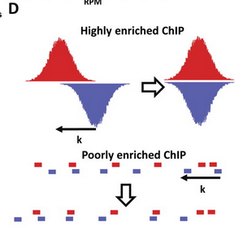
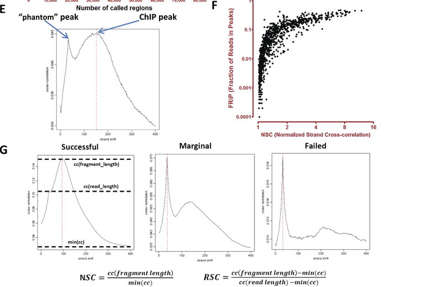
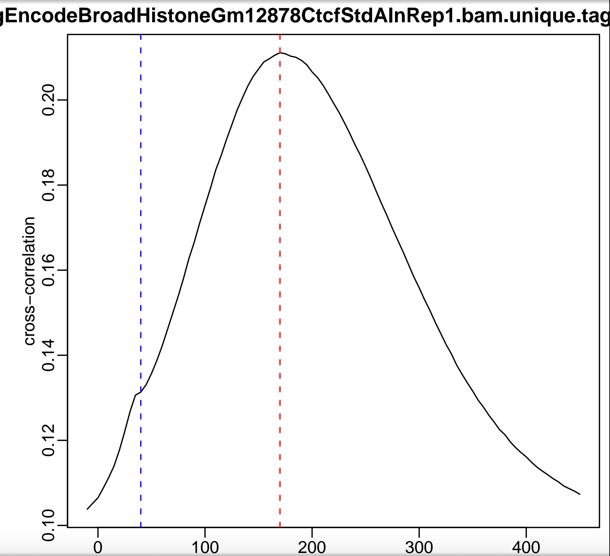
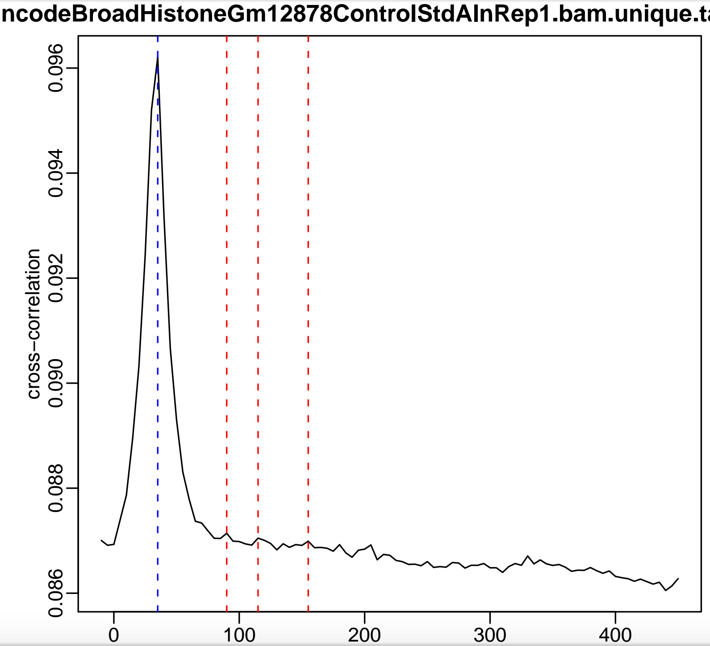
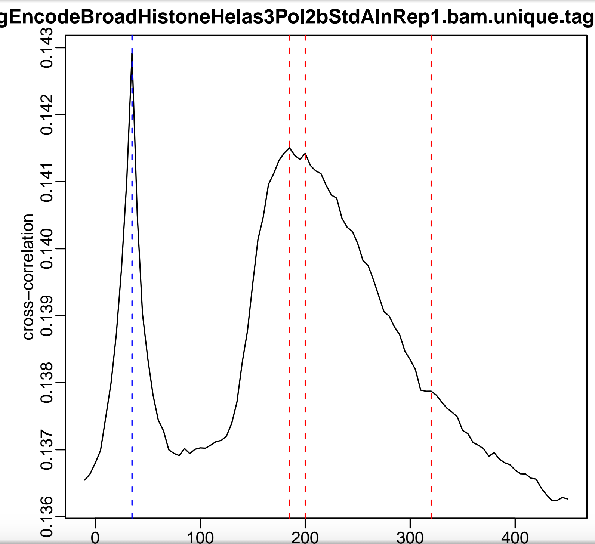

## Quality control of the ChIP-seq data.

First read these papers:

[ChIP-seq guidelines and practices of the ENCODE and modENCODE consortia](http://www.ncbi.nlm.nih.gov/pubmed/22955991)  
[Practical Guidelines for the Comprehensive Analysis of ChIP-seq Data](http://journals.plos.org/ploscompbiol/article?id=10.1371/journal.pcbi.1003326)   
[Sequencing depth and coverage: key considerations in genomic analyses](http://www.nature.com/nrg/journal/v15/n2/full/nrg3642.html)  
[Impact of sequencing depth in ChIP-seq experiments](http://nar.oxfordjournals.org/content/early/2014/03/05/nar.gku178)  
[Systematic evaluation of factors influencing ChIP-seq fidelity](http://www.nature.com/nmeth/journal/v9/n6/full/nmeth.1985.html)  
[Impact of artifact removal on ChIP quality metrics in ChIP-seq and ChIP-exo data](http://www.ncbi.nlm.nih.gov/pubmed/24782889)  
[Large-Scale Quality Analysis of Published ChIP-seq Data](http://www.g3journal.org/content/4/2/209.full)  


## Guidlines from Sherily Liu's lab
According to a [guideline](http://cistrome.org/chilin/_downloads/instructions.pdf) from Sherily Liu's lab, I summarize the matrics below (there are many matrics, we can just use some of them):  

### peak calling independent statistics
1. Fastq reads median quality score >= 25. This can be gotten by [FASTQC from Babaraham Institute](http://www.bioinformatics.babraham.ac.uk/projects/fastqc/). Many other good tools like Bismark for DNA methylation data mapping, and SeqMonk, a pretty cool GUI tool alternative to IGV are from this insititute as well.   According to Kadir, the sequencing core members will do initial quality control with the fastq files and will flag the file if quality of the file is bad.  In addition, they will trim off the adaptors when de-duplex.

2. Uniquely mapped reads. According to Encode best practise, for most transcription factors (TFs), ~10 million of uniquely mapped reads are good enough; for histone modifications, ~20 millions uniquely mapped reads are recommended. The more reads one sequences, the more peaks will show up. However,the peak number will saturate when a certain number of reads (~say 30 million for TFs) are sequenced. **A good uniquely mapped ratio is ≥ 60%.** bowtie1 will ouput this number, or we can get it by samtools.
  
**Duplicated reads** are reads with the same coordinates for the 5' and 3' end (maybe due to PCR artifact)
A special case is MNase-seq in which an enzyme is used to cut the DNA, and then sequence the nucelosome bound sequences. One will expect to find many duplicated reads. see [here](https://ethanomics.wordpress.com/2012/01/06/to-filter-or-not-to-filter-duplicate-reads-chip-seq/)
  
A read can be mapped to mulitple places, because of repetitive sequences in the genome, the aligner(BWA, bowtie) can not assign it uniquely to a place.  
For ChIP-seq, we only want the **uniquely mapped reads**.


[Print uniquely mapped reads](https://wikis.utexas.edu/display/bioiteam/Samtools+tricks)
`samtools view -bq 1 <bam>`

It looks like one should [abandon](https://www.biostars.org/p/101533/#101537) the concept of uniquely mapped reads
>Bowtie2 will give an alignment a MAPQ score of 0 or 1 if it can map equally well to more than one location. Further, there's not always a perfect correspondence between the MAPQ of a read and the summary metrics it prints at the end (I'd need to go through the code again to determine how it arrives at the printed summary metrics, that's not documented anywhere). Finally, you would be well served to completely abandon the concept of "uniquely mapped". It is never useful and is always misleading, since you're simply lying to by labeling something unique. You're better served by simply filtering on a meaningful MAPQ (5 or 10 are often reasonable choices), which has the benefit of actually doing what you want, namely filtering according the the likelihood that an alignment is correct.
>

Simply filter the bam with  MAPQ (mapping quality of the reads), 5 or 10 is usually reasonable:
 
`samtools view -b -q 10 foo.bam > foo.filtered.bam`  
or if you only want the number:  
`samtools view -c -b -q 10 foo.bam`

### peak calling dependent statistics

4. Peak number for each replicate called by MACS2 with fixed extension size (~200bp) and qvalue cutoff. A good peaks number depends on your experiment.
5. Peak number for each replicates called by MACS2 where the fold change is ≥ 10.
6. Peak number for each replicates called by MACS2 where the fold change is ≥ 20.
7. Replicates reads correlation is the whole genome reads pearson correlation for all replicates with resolution 146. A good correlation score is ≥ 0.6. 
  
  Details: one can bin the genome into small bins with each bin say 1000 bp, then one can count how many reads in each bin.
  For replicates, a perason correlation or spearman correlation can be calculated. We can do it by using bedtools               [makewindows](http://bedtools.readthedocs.org/en/latest/content/tools/makewindows.html) for binning, and                      [muticov](http://bedtools.readthedocs.org/en/latest/content/tools/multicov.html) for counting the reads.

  [Deeptools](https://github.com/fidelram/deepTools/wiki/QC)  has a command to calculate these numbers as well. 
  
  It takes long time to run, because it calculate the reads numbers in each bin across the genome. One alternative is to just 
  count reads in the peaks called by MACS2, it will be much faster.

8. Replicates peaks overlapping number. How many peaks are overlapped among replicates.

9. Top peaks not overlap with blacklist regions ratio is the ratio of the merged top 5000 peaks (ordered by MACS2 -log           (qvalue)) which do not overlap with [blacklist region](https://sites.google.com/site/anshulkundaje/projects/blacklists).      This is expected to be ≥ 90%. We will remove peaks that overlap with blacklist regions using bedtools anyway.  

10. Top peaks overlap with union DHS number (ratio) is the ratio of the merged top 5000 peaks (ordered by MACS2 -log (qvalue))     which overlap with union DHS regions. Union DHS regions are obtained from ENCODE II UW DNase-seq Hypersensitive regions.      The union DHS regions was collected from 122 human datasets or 53 mouse datasets, we do not have union DHS of other           species. Union DHS generation methods is consisted of three steps: 1.for peaks length longer than 300bp, trim macs2 peaks     length to 300bp around macs2 summits, 2.if less than 300bp, preserve the original length, 3.merge the peaks overlap each      other. This is expected to be ≥ 70%.

    Also read this paper from John Stamatoyannopoulos group [The accessible chromatin landscape of the human genome](http://www.ncbi.nlm.nih.gov/pubmed/22955617). It has DHS sites in the supplementary materials.

11. Top peaks conservation plot is the Phastcons conservation scores distribution around +/- 2kb of the top 5000 merged peak      summits. Phastcons conservation scores are from placental mammals multiple alignment. For TFs and active histone mark the     plot should be shown as a sharp peak in the center.

    I do not have a script for this yet. I think one can just download the phastcons scores from UCSC genome browser, and the
    plot the score around the summits of the peaks. I will look into this if necessary.

12. Top peaks motif analysis is the motif analysis performed on the top 5000 merged peak summits. I will cover                    motif-enrichment analysis in another markdown file in the repo. Basically, MEME suite and HOMER will be used.

## ENCODE guidlines

From paper [ChIP-seq guidelines and practices of the ENCODE and modENCODE consortia](http://www.ncbi.nlm.nih.gov/pubmed/22955991)  

### Evaluation of ChIP-seq quality
**Cross-correlation analysis**
>A very useful ChIP-seq quality metric that is **independent of peak calling** is strand cross-correlation. It is based on the fact that **a high-quality ChIP-seq experiment produces significant clustering of enriched DNA sequence tags at locations bound by the protein of interest, and that the sequence tag density accumulates on forward and reverse strands centered around the binding site.** As illustrated in Figure 5D, these “true signal” sequence tags are positioned at a distance from the binding site center that depends on the fragment size distribution (Kharchenko et al. 2008). A control experiment, such as sequenced input DNA, lacks this pattern of shifted stranded tag densities (Supplemental Fig. S1). This has made it possible to develop a metric that quantifies fragment clustering (IP enrichment) based on the correlation between genome-wide stranded tag densities (A Kundaje, Y Jung, P Kharchenko, B Wold, A Sidow, S Batzoglou, and P Park, in prep.). **It is computed as the Pearson linear correlation between the Crick strand and the Watson strand, after shifting Watson by k base pairs (Fig. 5E)**. This typically produces two peaks when cross-correlation is plotted against the shift value: **a peak of enrichment corresponding to the predominant fragment length** and **a peak corresponding to the read length (“phantom” peak)** (Fig. 4E; Heinz et al. 2010; A Kundaje, Y Jung, P Kharchenko, B Wold, A Sidow, S Batzoglou, and P Park, in prep.).






>The **normalized ratio between the fragment-length cross-correlation peak and the background cross-correlation (normalized strand coefficient, NSC)** and the **ratio between the fragment-length peak and the read-length peak (relative strand correlation, RSC)** (Fig. 4G), are strong metrics for assessing signal-to-noise ratios in a ChIP-seq experiment. High-quality ChIP-seq data sets tend to have a larger fragment-length peak compared with the read-length peak, whereas failed ones and inputs have little or no such peak (Figs. 4G, 5A,B; Fig. 7, below). In general, we observe a continuum between the two extremes, and **broad-source data sets are expected to have flatter cross-correlation profiles than point-sources, even when they are of very high quality.** As expected, the NSC/RSC and FRiP metrics are strongly and positively correlated for the majority of experiments (Fig. 4F). As with the other quality metrics, even high-quality data sets generated for factors with few genuine binding sites tend to produce relatively low NSCs.

>These measures form the basis for one of the current quality standards for ENCODE data sets. **We repeat replicates with NSC values <1.05 and RSC values <0.8** and, if additional replicates produce low values, we include a note with the reported data set (Box 3). We illustrate the application of our ChIP-seq quality metrics to a failed pair of replicates in Figure 5, A–E. Initially, two EGR1 ChIP-seq replicates were generated in the K562 cell line. Based on the cross-correlation profiles, FRiP score, and number of called regions, these replicates were flagged as marginal in quality. The experiments were repeated, with all quality control metrics improving considerably. On this basis, the superior measurements replaced the initial ones in the ENCODE database.


### Understanding NSC and RSC
From Ashul:

####Normalized strand cross-correlation coefficient (NSC)

Genome-wide correlation between + and - strand read counts when shifted by fraglen/2 relative to background. Represents enrichment of clustered ChIP fragments around target sites. 

Input-DNA values  are used as a reference for calibration.

Diffused marks such as H3K9me3 inherently have lower signal to noise ratios and hence NSC compared to strong active marks such as H3K4me3.

**Samples with very low seq. depth can have abnormally high NSC** since there is a significant depletion of 'background'. i.e. these samples tend to have higher specificity but very low sensitivity." 

####Relative strand cross-correlation coefficient (RSC)

Relative enrichment of fragment-length cross-correlation to read-length cross-correlation (phantom peak). 

The read-length cross-correlation is a baseline correlation that is entirely due to an inherent mappability-bias for reads to separated on + and - strand by read-length.

The fragment length cross-correlation (which is due to clustering of relatively fixed sized fragment around target sites) should be able to beat the read-length correlation for highly enriched datasets with sufficient localized target sites. So a RSC value > 0.8 is desirable in general.

**Marks that tend to be enriched at repeat-like regions and those that have low signal to noise ratios with diffused genome-wide patterns can have stronger read-length peaks and RSC values < 0.8**

#### A very [old post](https://groups.google.com/forum/#!msg/macs-announcement/XawMJuBLYrc/ErL5oWVUWdYJ) by Ashul in the MACS google group back to 2012

>A useful way of estimating fragment length (different from how MACS does it) is to compute a strand cross-correlation profile of read start density on the + and - strand i.e. **you compute the number of read starts at each position on the + strand and separately on the - strand for each chromosome. Then simply shift these vectors wrt each other and compute the correlation for each shift.** You can then plot a cross-correlation profile as the cross-correlation values on the y-axis and the shift that you used to compute the correlation on the x-axis. This is the cross-correlation profile for the dataset. Due to the 'shift' phenomenon of reads on the + and - strand around true binding sites, one would get a peak in the cross-correlation profile at the predominant fragment length. 

**Side notes from me: for reads starting at EACH position, there are three conditions: only one read starts (no duplicates) at there, or there is no read starts (no reads mapping), or several reads (potential PCR duplicates). So in reality, the number of reads are calculated by implicit aggregation over 5 bp sliding windows.**


>For a really strong ChIP-seq dataset such as say CTCF in human cells (great antibody and 45-60K peaks typically), the cross-correlation profile looks like what u see in the attached Figure CTCF.pdf. Notice the RED vertical line which is the dominant peak at the true peak shift. Also notice the little bump (the blue vertical line). This is at read-length.



>At the other extreme, lets take a control dataset (input DNA). The cross-correlation profile is shown in CONTROL.pdf. Now notice how the strongest peak is the blue line (read length) and there is basically almost no other significant peak in the profile. The absence of a peak shud be expected since unlike a ChIP-seq dataset for input DNA one expects no significant clustering of fragments around specific target sites (except potentially weak biases in open chromatin regions depending on the protocol used). Now the read-length peak occurs due to unique mappability properties of the mapped reads. **If a position 'i' on the + strand in the genome is uniquely mappable (i.e. a read starting at 'i' on the + strand maps uniquely), it implies that the position 'i+readlength-1' is also uniquely mappable on the - strand (ie. a read starting at i+readlength-1 on the - strand maps uniquely to that position)**. So in the input dataset or in random scattering of reads to uniquely mappable locations (in a genome made up of unmappable, multimappable locations and unique mappable locations), **there is a greater odds of finding reads starting on the + and - strand separated by read-length than any other shift.** Which is why the cross-correlation profile peaks at read-length compared to other values of strand-shift and the cross-correlation at the true fragment length/peak-shift is washed away since there are is no significant +/- strand read density shift in the input dataset.



>Now take a look at what you get for some a ChIP-seq dataset that is an inbetween case.

>POL2B.pdf : has few peaks (just about 3000 detectable ones in the human genome), this particular antibody is not very efficient (there are other POL2 antibodies that are very effective) and these are broad scattered peaks (following elongation patterns of POL2). Notice how you now have 2 peaks in the cross-correlation profile. One at the true peak shift (~185-200 bp) thats the one marked in red and the other at read length (the one marked in blue). For such weaker datasets, the read-length peak starts to dominate. Depending on the data quality characteristics of the dataset, the read-length peak scales relative to the true fragment length peak.



>So long story short, MACS effectively tends to just pick up just the strongest peak in the cross-correlation profile (although it uses a different method of estimating the peak-shift) and for datasets that have the properties listed at the top of this email, basically it picks up the read length. For strong datasets, it picks up the true shift. What one needs to do is find the peak in the cross-correlation profile ignoring any peak at read-length (which may be stronger or weaker than the other peaks in the profile). This always gives reliable estimates of fragment length (d/peak-shift). We have confirmed this using paired-end sequencing on a variety of different TFs and histone marks with different binding characteristics and ubiqiuity (where you can actually observe the distribution of fragment lengths for comparison). We have seen this phenomenon in a large number of datasets (ENCODE and modENCODE datasets). We have a paper in press right now that deals with this phenomenon as well as how it can be used as a useful data quality measure. Once it is published I can send a link to those interested.

>If you would like to have some code that computes the fragment length based on the cross-correlation method shoot me an email. I am hesitant to link it here without Tao's permission, since it uses the code-base from another peak caller. You can then use the --shift-size parameter set to 1/2 the estimated fragment length with --no-model. You will notice significantly better results with a correctly estimated 'd'.

>I think at some point, it might be useful to have this cross-correlation method incorporated within MACS so as to make the d estimation more robust (which is probably one of the only unstable aspects of an otherwise fantastic peak caller).

>Thanks,
>Anshul.


#### see a discussion on [biostars](https://www.biostars.org/p/18548/) 


### Calculate fragment length, NSC and RSC by [phantompeakqualtools](https://code.google.com/p/phantompeakqualtools/)

```
===========================
GENERAL USAGE
===========================
Usage: Rscript run_spp.R <options>
===========================
TYPICAL USAGE
===========================
(1) Determine strand cross-correlation peak / predominant fragment length OR print out quality measures
        
        Rscript run_spp.R -c=<tagAlign/BAMfile> -savp -out=<outFile>
        
-out=<outFile> will create and/or append to a file named <outFile> several important characteristics of the dataset.
The file contains 11 tab delimited columns

COL1: Filename: tagAlign/BAM filename
COL2: numReads: effective sequencing depth i.e. total number of mapped reads in input file
COL3: estFragLen: comma separated strand cross-correlation peak(s) in decreasing order of correlation.
          The top 3 local maxima locations that are within 90% of the maximum cross-correlation value are output.
          In almost all cases, the top (first) value in the list represents the predominant fragment length.
          If you want to keep only the top value simply run
          sed -r 's/,[^\t]+//g' <outFile> > <newOutFile>
COL4: corr_estFragLen: comma separated strand cross-correlation value(s) in decreasing order (col2 follows the same order)
COL5: phantomPeak: Read length/phantom peak strand shift
COL6: corr_phantomPeak: Correlation value at phantom peak
COL7: argmin_corr: strand shift at which cross-correlation is lowest
COL8: min_corr: minimum value of cross-correlation
COL9: Normalized strand cross-correlation coefficient (NSC) = COL4 / COL8
COL10: Relative strand cross-correlation coefficient (RSC) = (COL4 - COL8) / (COL6 - COL8)
COL11: QualityTag: Quality tag based on thresholded RSC (codes: -2:veryLow,-1:Low,0:Medium,1:High,2:veryHigh)

You can run the program on multiple datasets in parallel and append all the quality information to the same <outFile> for a summary analysis.

Qtag is a thresholded version of RSC.
```
**we need column 3 (fragment length) column 9 (NSC) and column 10 (RSC)** of the outFile.

>NSC values range from a minimum of 1 to larger positive numbers. 1.1 is the critical threshold. 
Datasets with NSC values much less than 1.1 (< 1.05) tend to have low signal to noise or few peaks (this could be biological eg.a factor that truly binds only a few sites in a particular tissue type OR it could be due to poor quality)

>RSC values range from 0 to larger positive values. 1 is the critical threshold.
RSC values significantly lower than 1 (< 0.8) tend to have low signal to noise. The low scores can be due to failed and poor quality ChIP, low read sequence quality and hence lots of mismappings, shallow sequencing depth (significantly below saturation) or a combination of these. Like the NSC, datasets with few binding sites (< 200) which is biologically justifiable also show low RSC scores.

#### NOTES:

- It is **EXTREMELY important to filter out multi-mapping reads from the BAM/tagAlign files**. Large number of multimapping reads can severly affect the phantom peak coefficient and peak calling results.

- If a dataset seems to have high PCR bottlenecking, then you might want to actually clamp the number of unique mappping reads per position to 1 or upto 5. If not the phantom peak coefficient can be artificially good.

- For the IDR rescue strategy, one needs to pool reads from replicates and then shuffle and subsample the mapped reads to create two balanced pseudoReplicates. This is much easier to implement on tagAlign/BED read-mapping files using the unix 'shuf' command. So it is recommended to use the tagAlign format.

- In most cases, you can simply use the maximum reported strand correlation peak as the predominant fragment length.
However, it is useful to manually take a look at the cross-correlation plot to make sure the selected max peak is not an artifact.

- Also, if there are problems with library size-selection, a dataset's cross-correlation profile can have multiple strong cross-correlation peaks. This is currently not autodetected.


`Rscript run_spp.R -c=<tagAlign/BAMfile> -savp -out=<outFile>`

It is better to specifiy a temp directory, and later you can remove everything in the temp dir.

`time Rscript /scratch/genomic_med/mtang1/softwares/phantompeakqualtools/run_spp.R -c=sample.sorted.bam -savp -out=sample-cross-correlation.txt -tmpdir="."`


`real	35m10.321s
user	36m8.622s
sys	0m13.043s`

A pdf file will be produced like fig4G above.
>In almost all cases, the top (first) value in the list represents the predominant fragment length.
          If you want to keep only the top value simply run
          sed -r 's/,[^\t]+//g' outFile  newOutFile
          
          
For this particular bam file  
fragment length: 230  
NSC: 1.042359  
RSC: 1.014053

**These are very robust matrices for ChIP-seq quality evaluation.** 


### The thresholds for TF ChIP-seq and histone modification ChIPs-seq are different.

I had a conversation with Anshul Kundaje(An ENCODE person and author of phantompeakqualtools) on twitter:

For  ChIP-seq quality control with phantompeakqualtools, do you repeat the experiment only when BOTH NSC < 1.05 AND RSC < 0.8? @anshul thx

>Dataset is flagged when both NSC & RSC below these thresholds for TF ChIP-seq (different from histones) 
>

Thx. what's the cut-off for histone ChIP-seq? and sometimes, we have NSC > 1.05 but RSC < 0.8, or NSC < 1.05 but RSC > 0.8.
>
> Depends on histone. See [here](https://docs.google.com/spreadsheets/d/1yikGx4MsO9Ei36b64yOy9Vb6oPC5IBGlFbYEt-N6gOM/edit#gid=15) for approx. distribution of NSC/RSC for histones (Col AZ-BR) For **broad marks NSC usually in the range of 1.03. RSC in the range of 0.4-0.8.Narrow marks more similar to TF range**.

do you have a note on what histone-modifications are broad and narrow? For H3K4me3, it can be broad as well. see this paper [Broad H3K4me3 is associated with increased transcription elongation and enhancer activity at tumor-suppressor genes](http://www.ncbi.nlm.nih.gov/pubmed/26301496) 

>Yes. H3K4me3 can have broad domains but **overall** it is more predominantly a narrow mark from signal-to-noise perspective. I dont have a comprehensive list. Shud create one. For now ask me specific mark - I can tell u signal-to-noise categorization.

thx. I am quality control (narrow?)H3K4me3, H3K4me, H3K27ac. and (broad?) H3K9me3, H3K27me3, H3K79me2. Looking forward to the list

>this categorization is correct. Although H3K79me2 usually has high SNR between narrow and broad marks.

### Measuring global ChIP enrichment (FRiP)

>For point-source data sets, **we calculate the fraction of all mapped reads that fall into peak regions identified by a peak-calling algorithm** (Ji et al. 2008). Typically, a minority of reads in ChIP-seq experiments occur in significantly enriched genomic regions (i.e., peaks); the remainder of the read represents background. The fraction of reads falling within peak regions is therefore a useful and simple first-cut metric for the success of the immunoprecipitation, and is called FRiP (fraction of reads in peaks). In general, FRiP values correlate positively and linearly with the number of called regions, although there are exceptions, such as REST (also known as NRSF) and GABP, which yield a more limited number of called regions but display very high enrichment (Fig. 4C). Most (787 of 1052) ENCODE data sets have a FRiP enrichment of 1% or more when peaks are called using MACS with default parameters. **The ENCODE Consortium scrutinizes experiments in which the FRiP falls below 1%.**

>The 1% FRiP guideline works well when there are thousands to tens of thousands of called occupancy sites in a large mammalian genome. However, passing this threshold does not automatically mean that an experiment is successful and **a FRiP below the threshold does not automatically mean failure.** For example, ZNF274 and human RNA polymerase III have very few true binding sites (Frietze et al. 2010; Raha et al. 2010), and a FRiP of <1% is obtained. At the other extreme, ChIP experiments using antibody/factor pairs capable of generating very high enrichment (such as REST and GABP mentioned above) and/or binding-site numbers (CTCF, RAD21, and others) can result in FRiP scores that exceed those obtained for most factors (Fig. 5C), even for experiments that are suboptimal. **Thus, FRiP is very useful for comparing results obtained with the same antibody across cell lines or with different antibodies against the same factor.**  **FRiP is sensitive to the specifics of peak calling, including the way the algorithm delineates regions of enrichment and the parameters and thresholds used. Thus, all FRiP values that are compared should be derived from peaks uniformly called by a single algorithm and parameter set.**

According to this paragraph from the paper, we need to call peaks first, and then count how many reads fall into the called peaks. This number divided by the total mapped reads number is the **FRiP**.


 

###Consistency of replicates: Analysis using IDR
to be continuted....


