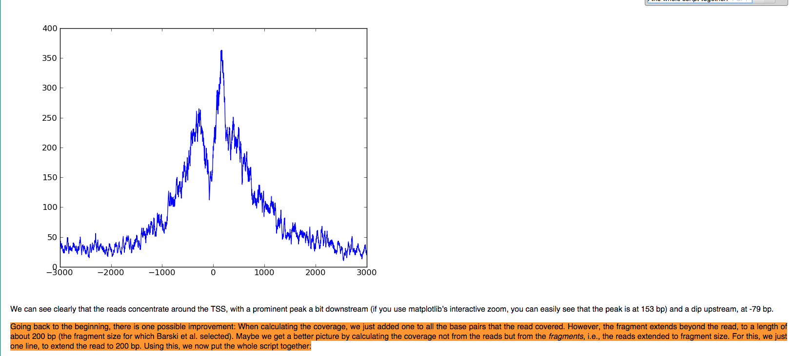
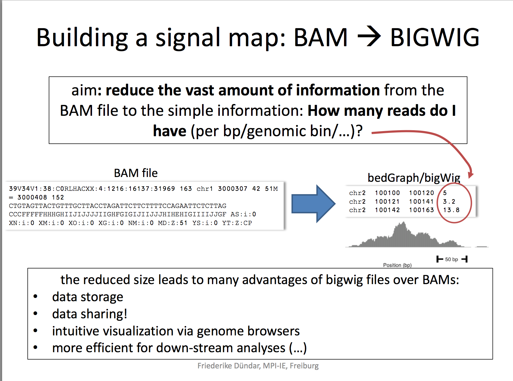
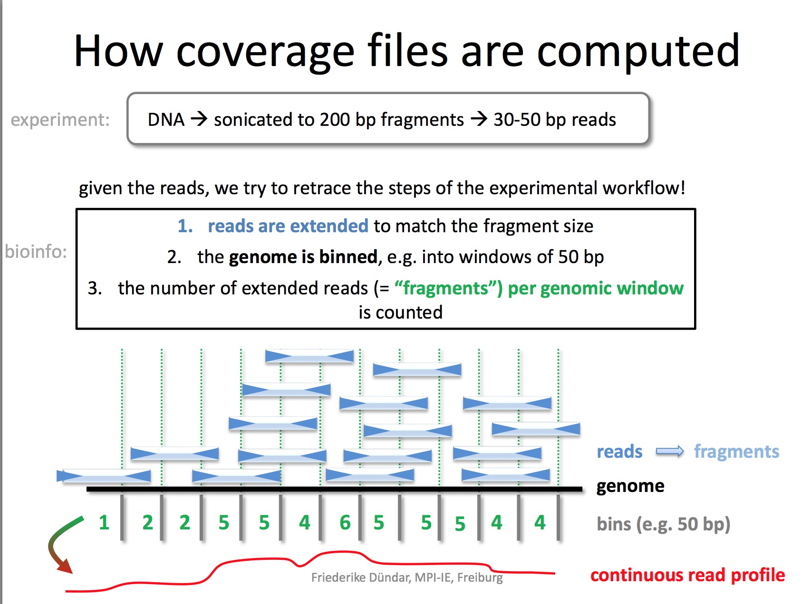
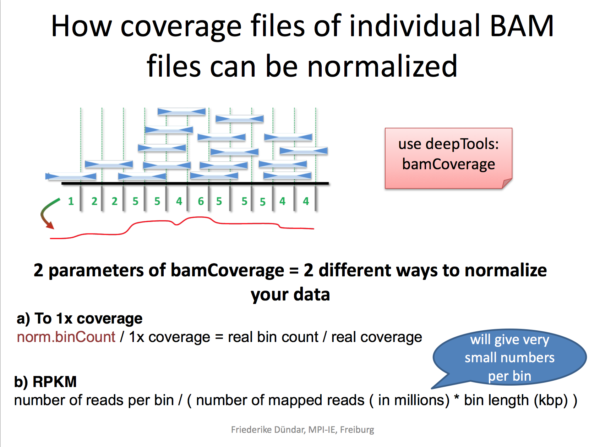

### Convert bam to bigwig for ChIP-seq bam

[Bigwig](http://genome.ucsc.edu/goldenpath/help/bigWig.html) is very good for visualization in IGV and UCSC genome browser.There are many tools to convert bam to bigwig. 

Make sure you understand the other two closely related file formats:  
 
* [bedgraph](http://genome.ucsc.edu/goldenpath/help/bedgraph.html):The bedGraph format is an older format used to display sparse data or data that contains elements of varying size.  
* [wig file](http://genome.ucsc.edu/goldenpath/help/wiggle.html): The wiggle (WIG) format is an older format for display of dense, continuous data such as GC percent, probability scores, and transcriptome data. Wiggle data elements must be **equally sized**.

See my old blog posts:  
[My first play with GRO-seq data, from sam to bedgraph for visualization](http://crazyhottommy.blogspot.com/2013/10/my-first-play-with-gro-seq-data-from.html)  
[hosting bigwig by dropbox for UCSC visualization](http://crazyhottommy.blogspot.com/2014/02/hosting-bigwig-by-dropbox-for-ucsc.html)  
[MeDIP-seq and histone modification ChIP-seq analysis](http://crazyhottommy.blogspot.com/2014/01/medip-seq-and-histone-modification-chip.html)  
bedtools genomeCoverage [convert bam file to bigwig file and visualize in UCSC genome browser in a Box (GBiB)](http://crazyhottommy.blogspot.com/2014/10/convert-bam-file-to-bigwig-file-and.html)   

MACS2 outputs bedgraph file as well, but the file is big. In addition, **extending the reads to 200bp** will exceed the chromosome ends in some cases. If you load the bedgraph to UCSC, you will get an error complaining this. One needs to use bedClip to get around with it.

[Fix the bedGraph and convert them to bigWig files](https://github.com/taoliu/MACS/wiki/Build-Signal-Track#Fix_the_bedGraph_and_convert_them_to_bigWig_files)  
[discussion on the macs google group](https://groups.google.com/forum/#!searchin/macs-announcement/bedgraph$20extend/macs-announcement/yefHwueKbiY/UsfWvFrdBh0J)

### How MACS1/2 output wig/bedgraph files are produced?

From [Tao liu](https://groups.google.com/forum/#!searchin/macs-announcement/bedgraph$20extend/macs-announcement/g29v40hMaIs/GREAyDqNxB8J):
>MACS uses 'd' to extend each tag before piling them up. As for + tag, extend it to the right for d size, and for - tag, **extend it to the left for d size**. But, before that, MACS will filter out redundant reads first. So if you used something like genomeCoverageBed tool on your alignment file directly, you would see a lot of inconsistencies. This method doesn't change between versions, however the way to filter out redundant reads changes. Before in MACS<1.4, MACS only keep 1 tag at the exactly same position, and after MACS1.4, MACS by default uses a binomial test to decide how many reads at the same position can be accepted.
>
>MACS version <2, doesn't do any normalization on the .wig files. However in my own research, I'd prefer to divide the fragment pileup (value in wiggle file) by total number of reads in million. 

>You can save the following content into a perl script such as spmr.pl:

```
#!/usr/bin/perl -w

open(IN,"$ARGV[1]");
open(OUT,">$ARGV[2]");

while(<IN>) {
    if (/^\d+/){
        chomp;
        @_=split;
        printf OUT "%d\t%.4f\n",$_[0],$_[1]/$ARGV[0];
    }
    else{
        print OUT $_;
    }
}
```
>Then if your data has 12.3 million reads, and you want to get the pileup per 10 million reads, run:

>`$ perl spmr.pl 1.23 some.wig some.wig.sp10mr`

From [Tao liu](https://groups.google.com/forum/#!searchin/macs-announcement/Sophia$20scaled$20--SPMR/macs-announcement/LZpliDkdN-8/5oAws6EHkHEJ)

>Wiggle or BedGraph file is in plain text format. So you can easily manipulate the file and divide the score column by a denominator from sequencing depth. I usually use sequencing depth in million reads after redundant reads being filtered out. You can check MACS log or xls output for these numbers. 


>For example, you have 3,123,456 reads after filtering. You can do:

>`$ awk -v OFS="\t" 'NF==2{print $1,$2/3.123456};END {print}' yourwig.wig` for variableStep wig.

>Or

>`$ awk -v OFS="\t" 'NF==4{print $1,$2,$3,$4/3.123456};END {print}'  yourbedgraph.bdg` for bedGraph.

For MACS2, it only produce bedgraph, not wig files any more.

**Are MACS1/2 ouput wig/bedgraph files scaled/normalized?**

>MACS14: No. They are raw pileup with tag extension.  Scaling is only used while calling peaks. Note that control track is generated by same tag extension as treatment. So it's not exactly the same as local bias from MACS, which is a maximum of average tag number from a small window(1kbp) and a larger window(10kbp). In brief, they are raw fragment pileup.

>MACS2: Yes. They are scaled. Especially with current --SPMR option, you will get values of signal per million reads. And control track is consistent with local bias calculated from MACS.


Check several subcommands from MACS2:

1. `predictd`, which can predict the best lag of + and - strand tags, through x-correlation;
2. `filterdup`, which can filter duplicate reads and convert any format into BED;
3. `pileup`, which can extend + and - strand tags into fragments of given length, then pile them up into a bedGraph file.

### Why do we need to extend the reads to fragment length/200bp?

Because in real experiment, we fragment the genome into small fragments of ~200bp, and pull down the protein bound DNA with antibodies. However, we only sequence the first 36bp(50bp, or 100bp depending on your library). To recapitulate the real experiment, we need to extend it to the fragment size.

That's what MACS buiding model is doing. MACS calculatea the length `d` that the reads need to be extended.

Three examples of extending reads:  
1. [HTSeq TSS plot](http://www-huber.embl.de/users/anders/HTSeq/doc/tss.html) 
   
2. paper [Integrative analysis of 111 reference human epigenomes](http://www.nature.com/nature/journal/v518/n7539/full/nature14248.html) Methods part:
>Mappability filtering, pooling and subsampling. **The raw Release 9 read alignment files contain reads that are pre-extended to 200 bp**. However, there were significant differences in the original read lengths across the Release 9 raw data sets reflecting differences between centres and changes of sequencing technology during the course of the project (36 bp, 50 bp, 76 bp and 100 bp). To avoid artificial differences due to mappability, for each consolidated data set the **raw mapped reads were uniformly truncated to 36 bp and then refiltered using a 36-bp custom mappability track to only retain reads that map to positions (taking strand into account) at which the corresponding 36-mers starting at those positions are unique in the genome.** Filtered data sets were then merged across technical/biological replicates, and where necessary to obtain a single consolidated sample for every histone >mark or DNase-seq in each standardized epigenome.  


3 paper [Impact of artifact removal on ChIP quality metrics in ChIP-seq and ChIP-exo data](http://www.ncbi.nlm.nih.gov/pubmed/24782889)

"IGV screenshot of an example CTCF ChIP signal showing the distribution of Watson and Crick signal around the CTCF motif and the distribution of Watson and Crick signal following extension of reads to the expected fragment length."


## Keep in mind when you convert ChIP-seq bam to bigwig files:
* extend the reads to 200bp, `d` predicted by MACS, or fragment length predicted by [phantomPeakqualtools](https://github.com/crazyhottommy/ChIP-seq-analysis/blob/master/part0_quality_control.md#calculate-fragment-length-nsc-and-rsc-by-phantompeakqualtools)
* normalize (to library size, RPKM or 1x genomic content like `deeptools`. see below)

### Using bedtools 

Install `bedClip` and `bedGraphToBigWig` [UCSC utilities](http://hgdownload.soe.ucsc.edu/admin/exe/linux.x86_64/) first.

**one can convert the bam to bed and the use bedtools slop to extend the reads to 3' for 200bp and then feed into bedtools coverage biostar [post](https://www.biostars.org/p/49163/)**

for 36bp single-end ChIP-seq reads:  
```
bamToBed -i input.bam | slopBed -i - -g genome_file_of_chr_sizes -s -r 164 | bedToBam -i - -g genome_file_of_chr_sizes > output_extended.bam
```
 
```bash
#! /bin/bash

for bam in *extended.bam
do 
echo $bam 
genomeCoverageBed -ibam $bam -bg -g hg19.genome.info > $(basename $bam .bam).bdg
done
```
Convert bedgraph to bigwig. credits go to [Tao Liu](https://gist.github.com/taoliu/2469050):

```bash
#!/bin/bash

# this script is from Tao Liu https://gist.github.com/taoliu/2469050 
# check commands: slopBed, bedGraphToBigWig and bedClip
 
which bedtools &>/dev/null || { echo "bedtools not found! Download bedTools: <http://code.google.com/p/bedtools/>"; exit 1; }
which bedGraphToBigWig &>/dev/null || { echo "bedGraphToBigWig not found! Download: <http://hgdownload.cse.ucsc.edu/admin/exe/>"; exit 1; }
which bedClip &>/dev/null || { echo "bedClip not found! Download: <http://hgdownload.cse.ucsc.edu/admin/exe/>"; exit 1; }
 
# end of checking
 
if [ $# -lt 2 ];then
    echo "Need 2 parameters! <bedgraph> <chrom info>"
    exit
fi
 
F=$1
G=$2
 
bedtools slop -i ${F} -g ${G} -b 0 | bedClip stdin ${G} ${F}.clip
 
bedGraphToBigWig ${F}.clip ${G} ${F/bdg/bw}
 
rm -f ${F}.clip

```

### Using Deeptools


I personally like to covert the bam files directly to [bigwig](https://genome.ucsc.edu/goldenPath/help/bigWig.html) files using [deeptools](https://github.com/fidelram/deepTools). Using 10bp as a bin size, I get a bigwig file of 205Mb and you can directly load it into IGV.  
`bamCoverage -b ../data/wgEncodeSydhHistonePanc1H3k27acUcdAlnRep1.bam --normalizeTo1x 2451960000 --missingDataAsZero yes --binSize 10 --fragmentLength 200 -o panc1_H3k27acRep1_deeptool_normalized.bw`  

`--fragmentLength 200` will extend the reads at 3' end to 200bp, which is more reasonable for ChIP-seq data. We only sequence the first (36)bp of the DNA fragment pulled down by antibodies.
see [here](https://www.biostars.org/p/49775/#158050)

I really like the demonstration of how coverage files are computed by the `deeptools` [author](https://docs.google.com/file/d/0B8DPnFM4SLr2UjdYNkQ0dElEMm8/edit?usp=sharing):  


**reads will be extended to 200bp before counting**



**which normalization you want to use? RPKM(like RNA-seq) or 1 x Coverage**:
  

RPKM:  
reads per kilobase per million reads  
The formula is: RPKM (per bin) = number of reads per bin /(number of mapped reads (in millions) * bin length (kp))  

RPGC:  
reads per genomic content  
used to normalize reads to 1x depth of coverage  
sequencing depth is defined as: (total number of mapped reads * fragment length) / effective genome size


### Using HTSeq

HTSeq is a python library that is designed for NGS sequencing analysis.
The [`HTSeq-count`](http://www-huber.embl.de/users/anders/HTSeq/doc/count.html) program is widely used for RNA-seq counting.

```python
import HTSeq

alignment_file = HTSeq.SAM_Reader("SRR817000.sam")
# HTSeq also has a BAM_Reader function to handle the bam file

# initialize a Genomic Array (a class defined in the HTSeq package to deal with NGS data,
# it allows transparent access of the data through the GenomicInterval object)
# more reading http://www-huber.embl.de/users/anders/HTSeq/doc/genomic.html#genomic

fragmentsize = 200

coverage = HTSeq.GenomicArray("auto", stranded = True, typecode = 'i')

# go through the alignment file, add count by 1 if in that Interval there is a read mapped there

for alignment in alignment_file:
  if alignment.aligned:
  	# extend to 200bp
  	almnt.iv.length = fragmentsize
    coverage[ alignment.iv] += 1

# it takes a while to construct this coverage array since python goes through every read in the big SAM file

# write the file to bedgraph
coverage.write_bedgraph_file ( "plus.wig", "+")
coverage.write_bedgraph_file ( "minus.wig", "-")

```
We get the wig file (Note, this wig is in 1 base resolution and strandness-specific), and then can convert wig to bigwig using UCSC [`wigToBigwig`](http://hgdownload.soe.ucsc.edu/admin/exe/linux.x86_64/).

### Correlation between replicates 

You need UCSC tool [`wigCorrelate`](http://hgdownload.cse.ucsc.edu/admin/exe/linux.x86_64/wigCorrelate
):


Run it:

`wigCorrelate H3K36me1_EE_rep1_FE.bw H3K36me1_EE_rep2_FE.bw`

### Compare the bigwig files between IP and input control. 

Use [`bamCompare`](https://github.com/fidelram/deepTools/wiki/Normalizations) from `deeptools` as well

>--scaleFactorsMethod 
>Here, you can choose how you would like to normalize to account for variation in sequencing depths. We provide:  
the simple normalization total read count  
the more sophisticated signal extraction (SES) method proposed by Diaz et al. for the normalization of ChIP-seq samples. We recommend to use SES only for those cases where the distinction between input and ChIP is very clear in the bamFingerprint plots. This is usually the case for transcription factors and sharply defined histone marks such as H3K4me3.  

>--ratio 
>Here, you get to choose how you want the two input files to be compared, e.g. by taking the ratio or by subtracting the second BAM file from the first BAM file etc. In case you do want to subtract one sample from the other, you will have to choose whether you want to normalize to 1x coverage (--normalizeTo1x) or to Reads Per Kilobase per Million reads (--normalizeUsingRPKM; similar to RNA-seq normalization schemes).

Or use [bwtools](https://github.com/CRG-Barcelona/bwtool).

